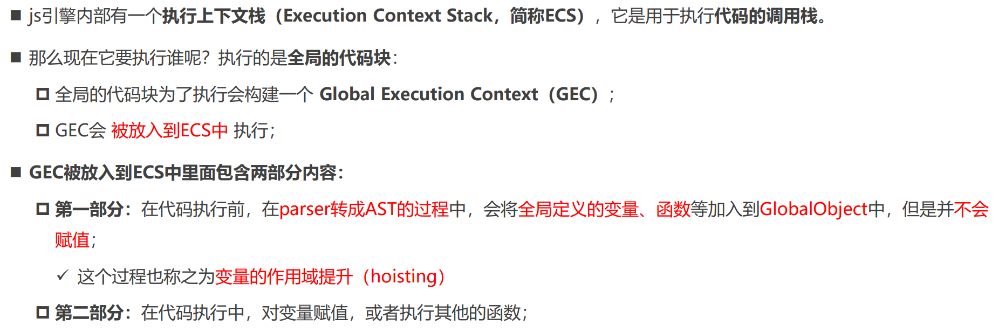

# 03 JavaScript运行原理

## V8引擎

V8是用C ++编写的Google开源高性能JavaScript和WebAssembly引擎，它用于Chrome和Node.js等


## JS执行流程

### 初始化全局对象

JS引擎会在执行代码之前，会在堆内存中创建一个**全局对象：Global Object（GO）=> window（如在浏览器中） **

- 该对象所有的作用域（scope）都可以访问
- 里面会包含Math、Date、Array、String、Number、setTimeout、setInterval等等
- 其中还有一个window属性指向自己

### 执行上下文（ Execution Contexts，EC ）

#### 执行上下文栈



#### VO对象

- 每一个执行上下文（EC）会关联一个**VO对象**（Variable Object，变量对象），变量和函数声明会被添加到这个VO对象中

- 在 GEC 中 VO 就是 GO
- 在 FEC  中 VO 就是 AO


#### 函数执行上下文

- 在执行的过程中执行到一个函数时，就会根据函数体创建一个**函数执行上下文（Functional Execution Context，FEC）**，并且压入到执行上下文栈 ECS 中，==只有在执行时才会创建AO，不执行是没有的== 
- 每个执行上下文都会关联一个VO，函数执行上下文 FEC 关联的 VO 是 **AO（Activation Object）**
    - 当进入一个函数执行上下文时，会创建一个AO对象，并作为执行上下文的VO
    - AO对象会使用arguments作为初始化，并且初始值是传入的参数


注意：

- 每次FEC执行完就会从栈顶弹出，GEC变为栈顶（还没执行完）
- 第二次执行函数 / 执行其他函数又要创建一个执行上下文进行执行，也就是新的FEC，新的VO
- 但先前的AO是否被销毁，取决于垃圾回收机制


## 作用域和作用域链（Scope Chain）

当进入到一个执行上下文时，执行上下文也会关联一个作用域链（Scope Chain）

作用域链是一个对象列表，用于变量标识符的求值；当进入一个执行上下文时，这个作用域链被创建，并且根据代码类型，添加一系列的对象

```js
var message = "Global Message"

function foo() {
  console.log(message)  // undefined（由于是在自己的AO里查找的）
  var message = "foo Message"
  console.log(message)  // foo Message
}

// 作用域链
function too() {
  console.log(message)  // global Message
}
```

- 全局对象 GO 的作用域链只有 GO
- 函数对象 AO 的作用域链在全局代码被解析时就已经被创建和确定（也就是在定义时就决定，与调用无关）
- ==也就是先在自己的 VO 里找，没有的话按照作用域链（作用域链是不包括自己的 VO【对于 function 也就是AO】）依次查找==

```js
var message = "global message"

function foo() {
    var name = "foo"
    function bar() {
        console.log(name)
    }
    return bar
}

var bar = foo()
bar()
```

