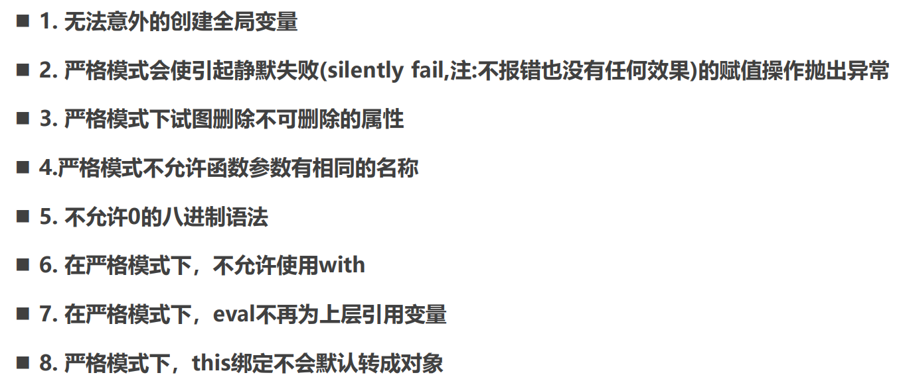

# 05 js函数的增强知识

## 函数属性与arguments

### 函数属性

js 中的函数是特殊的对象，可以使用类似对象的方式添加属性

```js
// 自定义属性
function foo() {
  
}
foo.message = "hello foo"
```

函数对象默认已经有一些属性，如 name, length（本应接收的参数个数）【剩余参数不计算】

```js
function foo(a, b, c) {}
var bar = function(m, n) {}
var baz = (i, j, ...args) => {}

foo.name // foo
bar.name // bar

foo.length // 3
bar.length // 2
baz.length // 2
```

### arguments

arguments 是一个对应于传递给函数的参数的**类数组（array-like）对象**

```js
function foo(m, n) {}
foo(1, 2, 3, 4)
// [arguments] [1, 2, 3, 4]
```

- arguments 类数组对象支持数组的一些特性
    - 索引访问
    - 遍历（for of 也支持）
    - 一些属性，如 length
- 但不支持数组的一些方法，如 filter, map等

### arguments转数组

在开发中，我们经常需要将 arguments 转成 Array，以便使用数组的一些特性

1. 遍历 arguments，添加到新数组中

```js
var newArguments = []
for (var arg of arguments) {
    newArguments.push(arg)
}
```

2. （了解）调用数组 slice 函数的 call 方法

```js
var newArgs = [].slice.apply(arguments)  // apply显示绑定this->arguments再用slice
var newArgs = Array.prototype.slice.apply(arguments)
```

3. （★）ES6 中的两个方法 `Array.from()`和`[...arguments]`

```js
var newArgs1 = Array.from(arguments)

var newArgs2 = [...arguments] // 展开运算符
```

==注意：箭头函数不绑定 arguments==

#### 剩余参数

ES6中引用了rest parameter 来替代 arguments，可以将不定数量的参数放入到一个数组中

```js
function foo(m, n, ...args) {
  console.log(args)
}
foo(1, 2, 3, 4, 5, 6)  // [3,4,5,6]
```

- 剩余参数可以解决箭头函数不绑定 arguments 的问题
- args 是数组 Array，而不是类数组，有 filter, map 等方法
- 剩余参数需要写在所有其他参数之后


## 纯函数 Pure Function

- 确定的输入，一定会产生确定的输出
- 函数在执行过程中，不能产生副作用
    - 副作用表示在执行一个函数时，除了返回函数值之外，还对调用函数产生了附加的影响， 比如修改了全局变量，修改参数或者改变外部的存储

举例：`Array.slice()`->纯函数 和 `Array.splice()`->非纯函数

```js
var names = ["abc", "cba", "nba", "mba"]

// 1.slice: 纯函数
// 不会对原数组进行修改，而是生成一个新数组
var newNames = names.slice(0, 2)
console.log(names)  // ["abc", "cba", "nba", "mba"]

// 2.splice: 操作数组的利器(不是纯函数)
// 修改原数组
names.splice(2, 2)
console.log(names)  // ["abc", "cba"]
```

- 纯函数在 React 中较多被使用：React 中就要求无论是函数还是 class 声明一个组件，这个组件都必须像纯函数一样，保护它们的props不被修改


## 柯里化 Currying

只传递给函数单一参数来调用它，让它返回一个函数去处理剩余的参数，这一过程称为柯里化

- eg. f(a, b, c) => f(a)(b)(c)
- 柯里化不会调用函数，只是对函数进行了某种转换。

```js
// 普通函数
function foo1(x, y, z) {
  console.log(x + y + z)
}
foo1(10, 20, 30)

// 柯里化函数
function foo2(x) {
  return function(y) {
     return function(z) {
         console.log(x + y + z)
     }
  }
}
foo2(10)(20)(30)
```

```js
// 柯里化的箭头函数写法
var foo3 = x => y => z => console.log(x + y + z)
```

#### 柯里化的优点

1. 在函数式编程中，我们往往希望一个函数处理的问题尽可能的单一
2. 复用参数逻辑

```js
function makeAdder(num) {
  return count => num + count
}
var add5 = makeAdder(5)
add5(10)
```

#### 自动柯里化

```js
function currying(fn) {
  function curryFn(...args) {
    // 两类操作:
    // 1第一类操作: 继续返回一个新的函数, 继续接受参数
    // 2第二类操作: 直接执行fn的函数
    // 在调用过程中args的长度在不断增长，当达到原先fn的长度时停止
    if (args.length >= fn.length) { 
      // 执行第二类
      // return fn(...args)  // 展开运算符
      return fn.apply(this, args)
    } else { 
      // 执行第一类
      return function(...newArgs) {
        // return curryFn(...args.concat(newArgs))
        return curryFn.apply(this, args.concat(newArgs))
      }
    }
  }
  return curryFn
}

var fooCurry = currying(foo)
fooCurry(10)(20)(30)
```

注意：柯里化的实现依赖闭包，性能不高，可能导致内存泄漏，真实开发中使用次数不多


## 组合函数 Compose Function

对某一个数据进行函数的调用，执行两个函数fn1和fn2，这两个函数是依次执行的。为使操作简便，将两个函数进行组合依次调用，这称为组合函数

```js
// 组合函数的封装（传入多个函数，自动组合挨个调用）
function composeFn(...fns) {
  // 没有传参直接return
  if (fns.length <= 0) return
  // 遍历所有fn，如果不是函数直接报错
  for (let fn of fns) {
    if (typeof fn !== 'function') {
      throw new TypeError('fn must be a function')
    }
  }
  // 返回的新函数
  return function (...args) {
    // 先执行第一个函数（第一个函数的参数个数不确定，后续函数参数都是1）
    let result = fns[0].apply(this, args)
    // 挨个执行后面的函数
    for (let i = 1; i < fns.length; i++) {
      fn[i].apply(this, [result])
    }
    return result
  }
}
let newFn = composeFn(fn1, fn2)
```


## with / eval的使用

with：扩展一个语句的作用域链（不推荐使用，兼容性差且容易出现作用域混淆错误）

```js
var obj = {
  message: "Hello World"
}
// 在window中没找到 -> 到obj中去找
with (obj) {
  console.log(message)
}
```

eval：一个特殊的函数，将传入的字符串当做 JavaScript 代码来运行，同时将最后一句执行语句的结果，作为返回值（仅了解，可读性差、易受攻击、无法被V8引擎优化，开发中不会使用）

```js
var message = "Hello World"
var codeString = `var name = "why"; console.log(name); console.log(message); "abc";`
var result = eval(codeString)  // abc
```


## 严格模式 Strict Mode

支持严格模式的浏览器在检测到代码中有严格模式时，会以更加严格的方式对代码进行检测和执行

- 严格模式通过 抛出错误 来消除一些原有的静默（silent）错误
- 严格模式让 JS 引擎在执行代码时可以进行更多的优化（不需要对一些特殊的语法进行处理）
- 严格模式禁用了在 ECMAScript 未来版本中可能会定义的一些语法

```js
// 全局<script>和js文件开启严格模式
"use strict"

// 函数开启严格模式
function foo() {
  "use strict"
}
```

es6 中的 class, module等自动启用严格模式

严格模式的限制：


