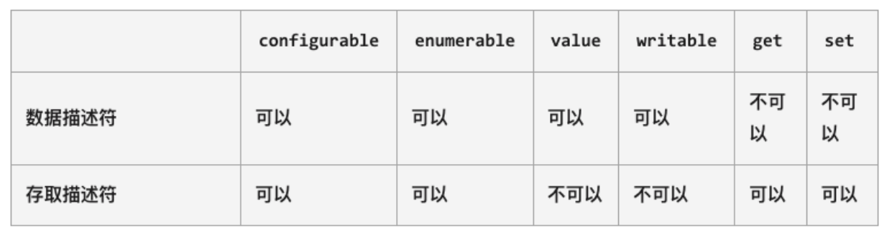
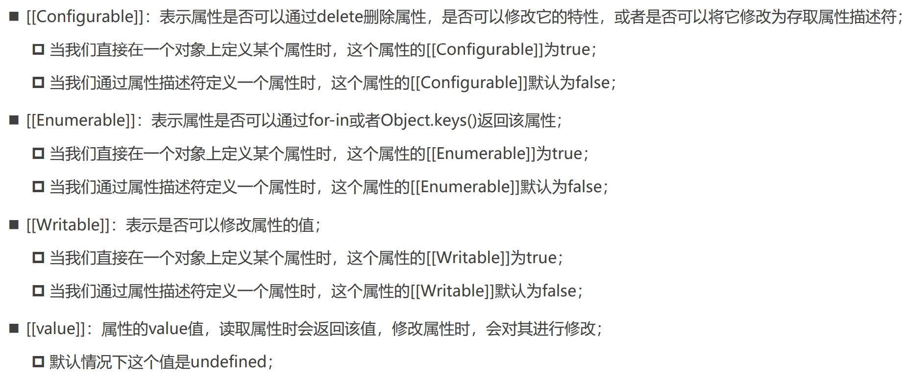
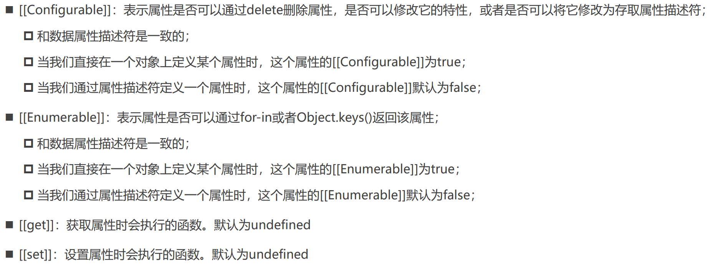

# 06 js对象的增强知识

对于对象的属性，直接定义/添加都不能对属性进行限制（如是否可以delete, 遍历, 读写等）。为对属性进行比较精准的操作控制，需要使用属性描述符 => 属性描述符需要用 Object.defineProperty 进行添加、修改

## Object.defineProperty

该方法会直接在一个对象上定义一个新属性，或者修改一个对象的现有属性，并返回此对象

```js
Object.defineProperty(obj, prop, descriptor)
// obj -> 要定义属性的对象
// prop -> 要定义或修改的属性的名称或Symbol
// descriptor -> 要定义或修改的属性描述符
```

两种属性描述符：




## 数据属性描述符



```js
Object.defineProperty(obj, "name", {
  configurable: false, // name属性不可以被删除
  enumerable: false, // name属性不可枚举(for in/Object.keys)
  writable: false, // name属性不可写入(只读属性readonly)
  value: "coderwhy" // 读取任何属性都返回这个value，默认是undefined
})
```


## 存取属性描述符



```js
var _name = ""
Object.defineProperty(obj, "name", {
  // configurable和enumerable与数据属性描述符一致
  configurable: true,
  enumerable: false,
  set: function(value) {
    console.log("set方法被调用了", value)
  },
  get: function() {
    console.log("get方法被调用了")
    return _name
  }
})
```


## Object.defineProperties

该方法直接在一个对象上定义**多个**新的属性或修改现有属性，并且返回该对象

```js
Object.defineProperties(obj, {
  name: {
    configurable: true,
    writable: false
  },
  age: {
    get: () => this._age
  },
  height: {
    set: (value) => console.log(value)
  }
})
```


## 对象方法补充（了解）

```js
var obj = {
  name: "why",
  age: 18
}

// 1.获取属性描述符
console.log(Object.getOwnPropertyDescriptor(obj, "name"))
console.log(Object.getOwnPropertyDescriptors(obj))

// 2.阻止对象的扩展
Object.preventExtensions(obj)
obj.address = "广州市"  // 无效

// 3.密封对象(不能进行配置，可以修改)
// 实际是调用preventExtensions，并将所有现有属性的configurable设为false
Object.seal(obj)
delete obj.name  // 无效

// 4.冻结对象(不能进行写入)
// 实际是调用seal，并将所有现有属性的writable设为false
Object.freeze(obj)
obj.name = "kobe"
console.log(obj)
```

