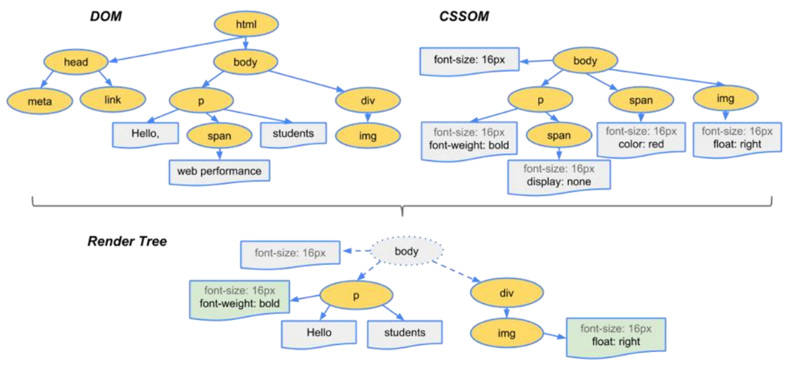

# 02 浏览器运行原理

## 网页解析过程


一般服务器只返回index.html，在html中碰到css, js, img等再去下载


## 浏览器渲染流程


具体步骤：

1. 解析HTML
2. 生成CSS规则（CSSOM CSS Object Model）
    - 在link中遇到CSS时浏览器去下载对应文件
    - **link元素不会阻塞DOM解析**（独立线程）
3. 构建Render Tree
    - 当有了DOM Tree和 CSSOM Tree后，就可以结合两者来构建Render Tree了
    - **link元素会阻塞Render Tree的构建过程**
    - Render Tree和DOM Tree并不是一一对应，比如对于display: none的元素，不会出现在render tree中



4. 布局（Layout）
    - Render Tree不表示每个节点的尺寸、位置等信息
    - 布局是确定呈现树中所有节点的宽度、高度和位置信息
5. 绘制（Paint）
    - 浏览器将布局阶段计算的每个frame转为屏幕上实际的像素点，包括文本、颜色、边框、阴影、替换元素（比如img）等

**注意：**

- HTML解析过程遇到CSS不会阻塞解析，但**遇到js（<script>）时会停止解析（不能继续构建DOM树）**，下载完成后执行js代码后再继续解析HTML构建DOM树
- 等到DOM树构建完成并且渲染再执行js的话，会造成严重的回流和重绘【主要由于js的作用之一是操作DOM的】，影响页面的性能
- 然而在Vue、React中js往往重于HTML，由于脚本处理时间较长，用户无法看到网页内容。因此出现了<script>中的两个属性**defer & async**使其在下载过程中不阻塞HTML解析


## 回流和重绘

### 回流 Reflow

第一次确定节点的大小和位置，称之为布局（layout）；之后对节点的大小、位置修改重新计算称之为回流（重排）。

**什么情况下引起回流？ **

- DOM结构发生改变（添加新的节点或者移除节点）
- 改变布局（修改了width、height、padding、font-size等值，eg. span这类由内容撑起的元素）
- 窗口resize（修改了窗口的尺寸等）
- 调用getComputedStyle方法获取尺寸、位置信息

### 重绘 Repaint

第一次渲染内容称之为绘制（paint）。之后重新渲染称之为重绘。

**什么情况下引起重绘？**

-  修改背景色、文字颜色、边框颜色、样式等

==重绘的性能消耗相对于回流小，但回流一定会引起重绘==


## 特殊解析 Composite合成

默认情况下，标准流中的内容都是被绘制在同一个图层（Render Layer）中，而一些特殊的属性，会创建一个新的合成层（Compositing Layer），且新的图层可以利用GPU加速渲染

例如：3D transforms；video、canvas、iframe；opacity 动画转换时；position: fixed；will-change：一个实验性的属性，提前告诉浏览器元素可能发生哪些变化；animation 或 transition 设置了opacity、transform

**Composite确实可以提高性能，但是它以内存管理为代价**


## defer & async

```html
<script src="script.js" defer></script>
```

### defer

- 加上defer之后，js文件的下载和执行, 不会影响后面DOM Tree的构建
- 如果脚本提前下载好了，它会等待DOM Tree构建完成再执行
- defer中的代码执行完成后才触发DOMContentLoaded事件
- 注意：
    - 多个defer会按照顺序执行
    - defer仅适用于外部脚本，对于script默认内容会被忽略。
    - **defer可以提高页面的性能，推荐放到<head>中**

### async

- 浏览器不会因 async 脚本而阻塞（与 defer 类似）
- async不能保证顺序，在下载完成后会立刻执行（比较危险）
    - 最好不要操作DOM，因为可能没有构建完成DOM Tree
- async不会能保证在DOMContentLoaded之前或者之后执行

### 对比

- defer通常用于需要在文档解析后操作DOM的JavaScript代码，并且对多个script文件有顺序要求的
- async通常用于独立的脚本，对其他脚本，甚至DOM没有依赖的

