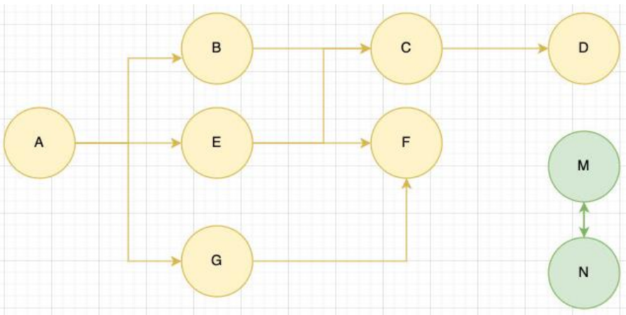
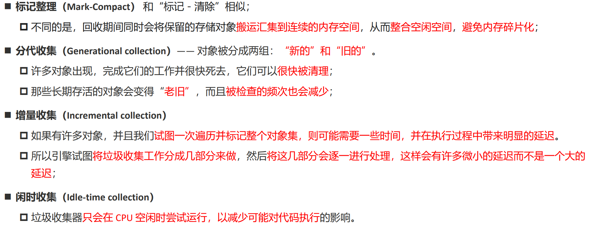
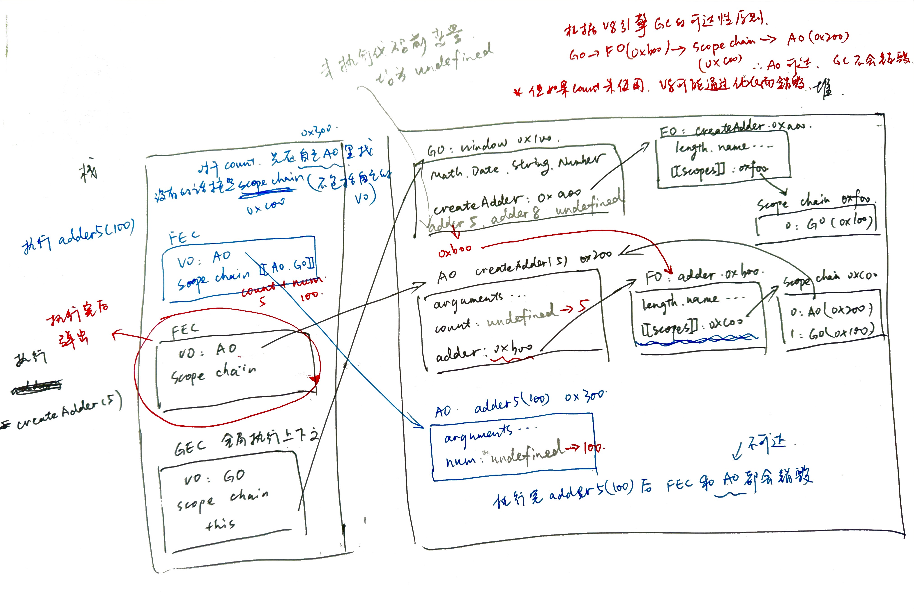

# 04 内存管理与闭包

## V8引擎的垃圾回收 GC——标记清除（mark-Sweep）

- 标记清除的核心思路是**可达性（Reachability） **==【核心】==
- 这个算法是设置一个根对象（root object）【在JS中是 window】，垃圾回收器会定期从这个根开始，找所有从根开始有引用到的对象，对于那些没有引用到的对象，就认为是不可用的对象
- 这个算法可以很好的解决循环引用的问题



V8引擎在GC算法上的优化（了解）：




## 闭包 Closure

**闭包：一个函数及其关联的环境**

- 【MDN解释】一个函数和对其周围状态（lexical environment，词法环境）的引用捆绑在一起（或者说函数被引用包围），这样的组合就是闭包（closure）
- 闭包让你可以在一个内层函数中访问到其外层函数的作用域（不仅限于js）
- js中每当创建一个函数，闭包就会在函数创建的同时被创建出来【**广义上说，js中的所有函数都形成闭包；但狭义上说，只有访问了外层作用域变量，才形成闭包**】

```js
function createAdder(count) {
  function adder(num) {
      return count + num
  }
  return adder
}
var adder5 = createAdder(5)
adder5(100)
```




## 闭包的内存泄漏

内存泄漏：对于那些我们永远不会再使用的对象，但是对于GC来说，由于仍满足可达性的要求，GC不会进行释放，对应内存会依然保留着 => **手动释放**

```js
adder5 = null
```

此时 adder5 指向的 FO 和作用域链均不可达，GC会将其回收

#### V8引擎对AO中不使用属性的优化

```js
function foo() {
  var name = "foo"
  var age = 18  // age由于未使用而销毁

  function bar() {
    console.log(name)
  }

  return bar
}
```