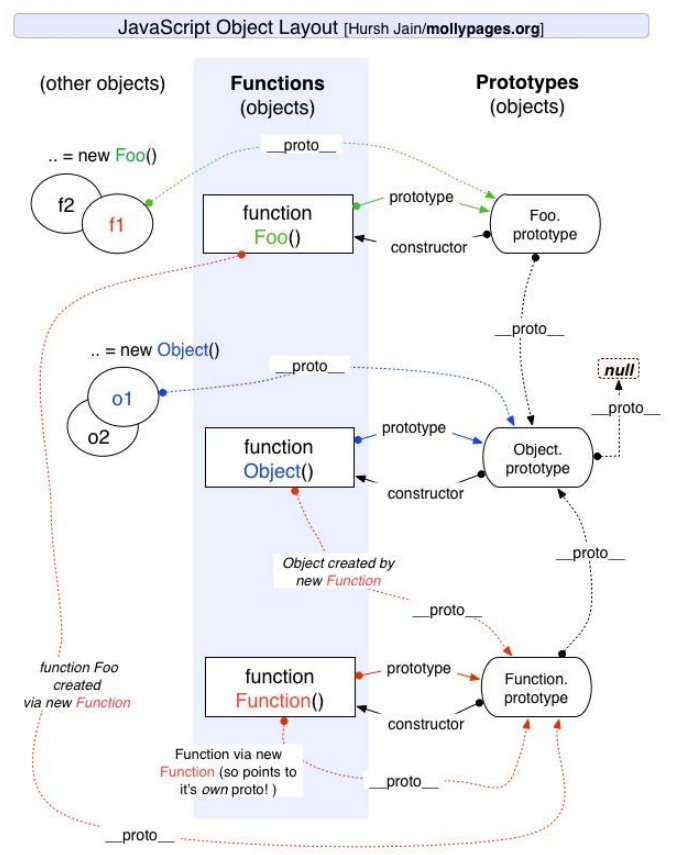
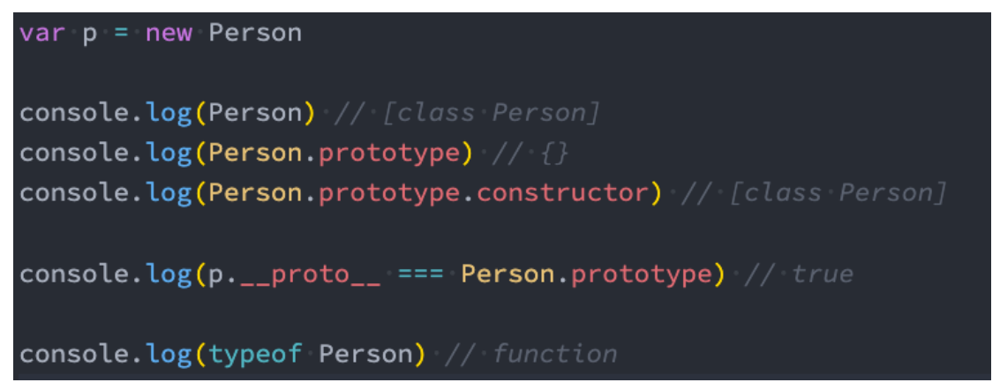

# 08 ES6 实现继承

## 回顾：原型继承关系




## class 定义类

```js
class Person {
  constructor(name, age) {
    this.name = name
    this.age = age
  }
  
  // 本质上是放在Person.prototype
  running() {
    console.log(this.name + 'running~')
  }
  eating = () => {
    console.log(this.name + 'eating~')
  }
}
```

```js
// 创建实例对象
var p1 = new Person("why", 18)

// 使用实例对象中属性和方法
console.log(p1.name, p1.age)
p1.running()
p1.eating()

console.log(Person.prototype === p1.__proto__)  // true
console.log(Person.running)  // undefined
console.log(Person.prototype.running)  // ✔
```



**本质上 class 是一种语法糖，但 class 定义的类不能通过函数进行调用【但其实也不需要】**

### 类的 get / set 访问器

```js
class Person {
  constructor(name) {
    this._name = name
  }

  set name(newName) {
    this._name = newName
  }

  get name() {
    return this._name
  }
}
```

### 静态方法

```js
class Person {
  constructor(age) {
    this.age = age
  }

  static create() {
    return new Person(Math.floor(Math.random() * 100))
    // return new this(Math.floor(Math.random() * 100))
  }
}
```


## ES6 类的继承 - extends

在子（派生）类的构造函数中使用this或者返回默认对象之前，必须先通过 **super** 调用父类的构造函数

```js
class Person {
  constructor(name, age) {
    this.name = name
    this.age = age
  }

  running() {
    console.log("running~")
  }
  eating() {
    console.log("eating~")
  }

}

class Student extends Person {
  constructor(name, age, sno, score) {
    super(name, age)
    this.sno = sno
    this.score = score
  }
  
  studying() {
    console.log("studying~")
  }
}
```

### super

- 执行 super(...) 调用父类的 constructor【必须在使用 this 前】
- 执行 super.method(...) 调用父类方法

```js
class Dog extends Animal {
  // 重写父类方法
  running() {
    console.log("dog四条腿")
    // 调用父类的方法
    super.running()
  }
}
```

### 继承内置类

```js
class HYArray extends Array {
  get lastItem() {
    return this[this.length - 1]
  }

  get firstItem() {
    return this[0]
  }
}
```

也可以通过 原型prototype 进行扩展

```js
Array.prototype.lastItem = function() {
  return this[this.length - 1]
}
```

### 类的混入 mixin

JavaScript 只支持**单继承**

要求：子类 Bird 同时"继承" Animal 和 Flyer两个类

```js
function mixinAnimal(BaseClass) {
  // 内部创建了一个类
  return class extends BaseClass {
    running() {
      console.log("running~")
    }
  }
}

function mixinRunner(BaseClass) {
  return class extends BaseClass {
    flying() {
      console.log("flying~")
    }
  }
}

class Bird {
  eating() {
    console.log("eating~")
  }
}
```

```js
class NewBird extends mixinRunner(mixinAnimal(Bird)) {
}
var bird = new NewBird()
bird.flying()
bird.running()
bird.eating()
```


## ES6 转 ES5（babel）

【待学】


## 手写 apply / call

【待学】