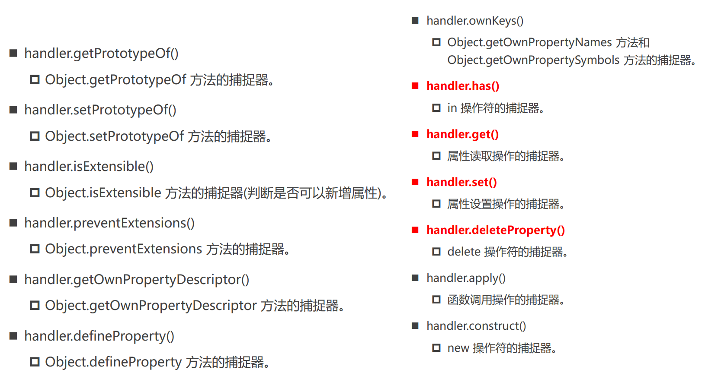

# 10 Proxy - Reflect

## 需求：监听对象的操作

### ES5（Object.defineProperty）

```js
// 1.针对一个属性
let _name = obj.name
Object.defineProperty(obj, "name", {
  set: function(newValue) {
    console.log("监听: 给name设置了新的值:", newValue)
    _name = newValue
  },
  get: function() {
    console.log("监听: 获取name的值")
    return _name
  }
})

// 2.监听所有的属性: 遍历所有的属性, 对每一个属性使用defineProperty
const keys = Object.keys(obj)
for (const key of keys) {
  let value = obj[key]
  Object.defineProperty(obj, key, {
    set: function(newValue) {
      console.log(`监听: 给${key}设置了新的值:`, newValue)
      value = newValue
    },
    get: function() {
      console.log(`监听: 获取${key}的值`)
      return value
    }
  })
}
```

- Object.defineProperty 设计的初衷，不是为了去监听截止一个对象中所有的属性
- 同时，如果我们想监听更加丰富的操作，比如新增属性、删除属性，那么 Object.defineProperty是无能为力的

### ES6（Proxy）

Proxy类帮助我们创建一个代理对象，之后对原对象的所有操作，都通过代理对象来完成，代理对象可以监听我们想要对原对象进行哪些操作


## Proxy的基本使用

- 首先，我们需要 new Proxy 对象，并且传入需要侦听的对象 target 以及一个处理对象 handler  `const p = new Proxy(target, handler)`
- 其次，我们之后的操作都是直接对 Proxy 的操作，而不是原有的对象，因为我们需要在handler里面进行侦听

### set 和 get 捕获器

如果我们想要侦听某些具体的操作，那么就可以在 handler 中添加对应的捕捉器（Trap）


```js
const objProxy = new Proxy(obj, {
  set: function(target, key, newValue) {
    console.log(`监听: 监听${key}的设置值: `, newValue)
    target[key] = newValue
  },
  get: function(target, key) {
    console.log(`监听: 监听${key}的获取`)
    return target[key]
  }
})
```

### Proxy 的所有捕获器



```js
const objProxy = new Proxy(obj, {
  deleteProperty: function(target, key) {
    console.log(`监听: 监听删除${key}属性`)
    delete obj.name
  },

  has: function(target, key) {
    console.log(`监听: 监听in判断 ${key}属性`)
    return key in target
  }
})

delete objProxy.name
console.log("age" in objProxy)
```

```js
function foo(num1, num2) {
  console.log(this, num1, num2)
}

const fooProxy = new Proxy(foo, {
  apply: function(target, thisArg, otherArgs) {
    console.log("监听执行了apply操作")
    target.apply(thisArg, otherArgs)
  },
  construct: function(target, otherArray) {
    console.log("监听执行了new操作")
    console.log(target, otherArray)
    return new target(...otherArray)
  }
})
```


## Reflect

==Reflect 本身就是一个对象，不需要 new==

Reflect 主要提供了很多操作 JavaScript 对象的方法，有点像 Object 中操作对象的方法

- 比如 Reflect.getPrototypeOf(target) 类似于 Object.getPrototypeOf(obj)
- 比如 Reflect.defineProperty(target, propertyKey, attributes) 类似于Object.defineProperty()

但已经有Object可以做这些操作，那么为什么还需要有Reflect这样的新增对象呢？

- 早期的 ECMA 规范中没有考虑到这种对对象本身的操作如何设计会更加规范，所以将这些API放到了 Object 上面（但是 Object 作为一个构造函数，这些操作实际上放到它身上并不合适）
- 另外还包含一些类似于 in、delete操作符，让 JavaScript 看起来是会有一些奇怪的
- 因此新增了 Reflect 将操作进行集中
- 在使用 Proxy 时，可以做到不操作原对象

### Reflect 的常用方法


```js
if (Reflect.deleteProperty(obj, "name")) {
  console.log("name删除成功")
} else {
  console.log("name没有删除成功")
}
```

### Reflect + Proxy共同完成代理

```js
const objProxy = new Proxy(obj, {
  set: function(target, key, newValue, receiver) {
    // target[key] = newValue
    // 1.好处一: 代理对象的目的: 不再直接操作原对象
    // 2.好处二: Reflect.set方法有返回Boolean值, 可以判断本次操作是否成功
    const isSuccess = Reflect.set(target, key, newValue)

    if (!isSuccess) {
      throw new Error(`set ${key} failure`)
    }
  },
  get: function(target, key, receiver) {

  }
})
```

### receiver 的作用

receiver 就是外层的 Proxy 对象

如果源对象（obj）有setter、getter的访问器属性，那么可以通过 receiver 来改变里面的 this

```js
const obj = {
  _name: "why",
  set name(newValue) {
    console.log("this:", this) // 还是obj
    this._name = newValue
  },
  get name() {
    return this._name
  }
}
```

```js
const objProxy = new Proxy(obj, {
  set: function(target, key, newValue, receiver) {
    // target[key] = newValue
    // 1.好处一: 代理对象的目的: 不再直接操作原对象
    // 2.好处二: Reflect.set方法有返回Boolean值, 可以判断本次操作是否成功
    /*
       3.好处三:
          > receiver就是外层Proxy对象
          > Reflect.set/get最后一个参数, 可以决定对象访问器setter/getter的this指向
    */
    console.log("proxy中设置方法被调用")
    const isSuccess = Reflect.set(target, key, newValue, receiver)

    if (!isSuccess) {
      throw new Error(`set ${key} failure`)
    }
  },
  get: function(target, key, receiver) {
    console.log("proxy中获取方法被调用")
    return Reflect.get(target, key, receiver)
  }
})
```

### Reflect 中的 construct（了解）

```js
function Person(name, age) {
  this.name = name
  this.age = age
}

function Student(name, age) {
  // Person.call(this, name, age)  借用构造函数
  const _this = Reflect.construct(Person, [name, age], Student)
  return _this
}

// const stu = new Student("why", 18)
const stu = new Student("why", 18)
console.log(stu)
console.log(stu.__proto__ === Student.prototype)  // true
```

