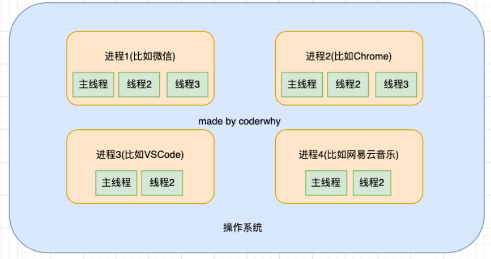
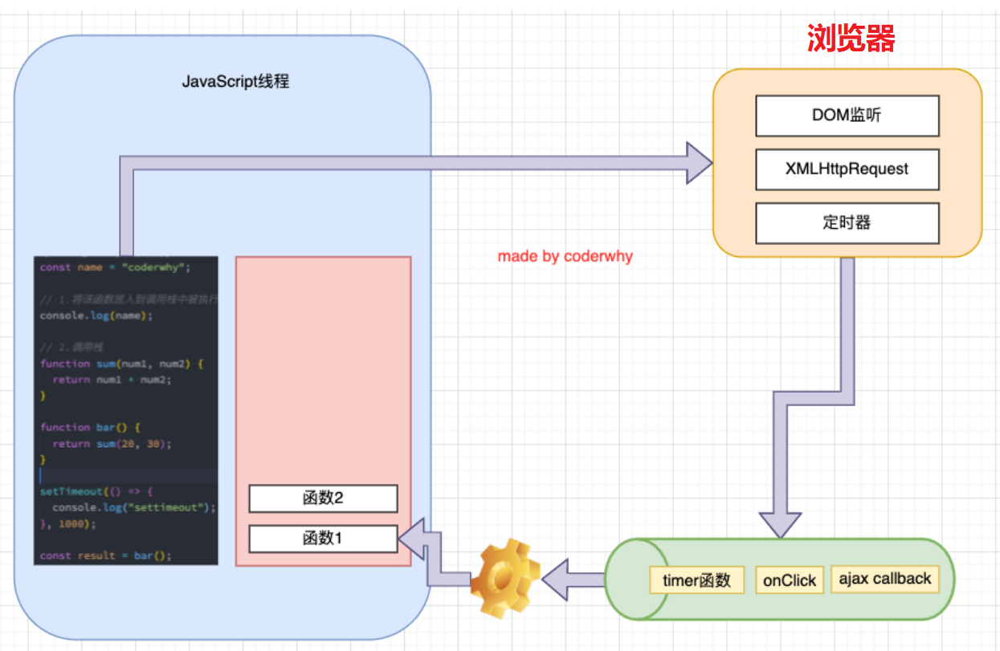
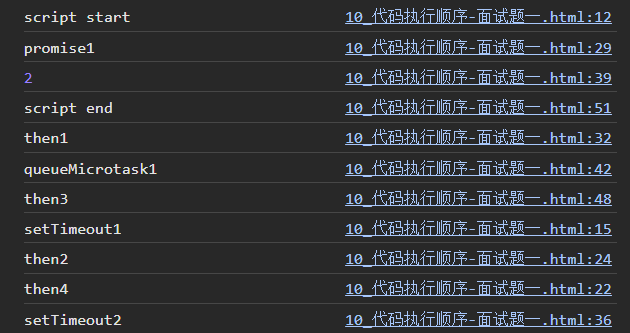
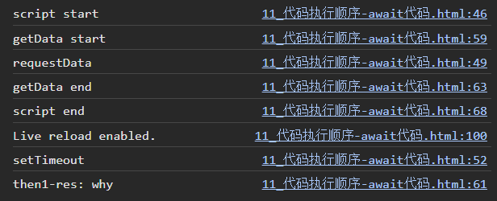
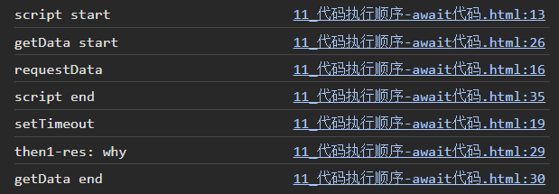
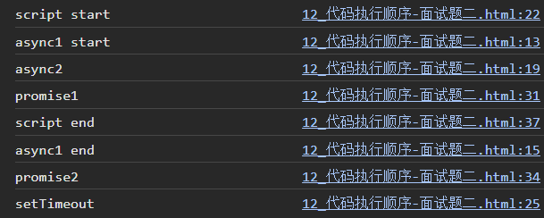

# 13 async await 事件循环

## 异步处理方案

需求：发送三次网络请求，每一次网络请求都依赖上一次返回的结果

### Promise 方案

```js
// 封装请求
function requestData(url) {
  return new Promise((resolve, reject) => {
    setTimeout(() => {
      resolve(url)
    }, 2000)
  })
}
```

方式一：层层嵌套（回调地狱 callback hell）

```js
function getData() {
  // 1.第一次请求
  requestData("why").then(res1 => {
    console.log("第一次结果:", res1)
    // 2.第二次请求
    requestData(res1 + "kobe").then(res2 => {
      console.log("第二次结果:", res2)
      // 3.第三次请求
      requestData(res2 + "james").then(res3 => {
        console.log("第三次结果:", res3)
      })
    })
  })
}
```

方式二：使用Promise进行链式调用重构（解决回调地狱）

```js
function getData() {
  requestData("why").then(res1 => {
    console.log("第一次结果:", res1)
    return requestData(res1 + "kobe")
  }).then(res2 => {
    console.log("第二次结果:", res2)
    return requestData(res2 + "james")
  }).then(res3 => {
    console.log("第三次结果:", res3)
  })
}
```

### Generator方案

```js
function* getData() {
  const res1 = yield requestData("why")
  const res2 = yield requestData(res1 + "kobe")
  const res3 = yield requestData(res2 + "james")
  const res4 = yield requestData(res3 + "curry")
}

const generator = getData()
// .value是一个Pending的Promise
generator.next().value.then(res1 => {
  generator.next(res1).value.then(res2 => {
    generator.next(res2).value.then(res3 => {
      generator.next(res3).value.then(res4 => {
        generator.next(res4)
      })
    })
  })
})
```

问题：我们无法确定调用Promise的层级（还是有回调地狱的代码）；同时可能有多处需要执行这样的函数，因此**封装自动执行generator函数 `execGenFn(genFn)`**

```js
// 【递归实现】
function execGenFn(genFn) {
  // 1.获取对应函数的generator
  const generator = genFn()
  // 2.定义一个递归函数
  function exec(res) {
    // result -> { done: true/false, value: 值(这里是Promise)/undefined }
    const result = generator.next(res)
    if (result.done) return
    result.value.then(res => {
      exec(res)
    })
  }
  // 3.执行递归函数
  exec()
}

execGenFn(getData)
```

### async/await方案

async/await本质是对Generator处理异步问题的语法糖

```js
async function getData() {
  const res1 = await requestData("why")
  const res2 = await requestData(res1 + "kobe")
  const res3 = await requestData(res2 + "james")
}
getData()
```


## async/await

### 异步函数 async function

- async（asynchronous）：异步、非同步

- sync（synchronous）：同步、同时

异步函数的写法：声明时加上 `async`

```js
async function foo1() {}
const foo2 = async function() {}
const foo3 = async () => {}
class Person {
  async foo() {}
}
```

### 异步函数的执行流程

1. 异步函数的内部代码执行过程和普通的函数是一致的，默认情况下也是会被同步执行
2. ==但是，异步函数有返回值时，和普通函数有区别==
    - 情况一：异步函数也可以有返回值，但是异步函数的返回值相当于被包裹到Promise.resolve中【因此，所有异步函数都可以`.then()`】
    - 情况二：异步函数的返回值是Promise，状态由会由Promise决定
        - 1）普通值
        - 2）新Promise
        - 3）thenable
    - 情况三：如果我们的异步函数的返回值是一个对象并且实现了thenable，那么会由对象的then方法来决定

当异步函数中有抛出异常（产生错误）, 这个异常不会立即被浏览器处理，而是进行如下处理：Promise.reject(error)【因此可以在调用时用`.catch`捕获】

```js
async function foo() {
  // "abc".filter()
  throw new Error("async function error")
  // return new Promise((resolve, reject) => {
  //   reject("err rejected")
  // })
  return 123
}

foo().then(res => {
  console.log("res:", res)
}).catch(err => {
  console.log("err:", err)
})
```

### await 关键字

==await必须在异步函数中使用==

- 通常使用await是后面会跟上一个表达式，这个表达式会返回一个Promise【不是说不能是普通值，只不过这样做没有太大的意义】
- await会等到Promise的状态变成fulfilled状态，之后继续执行异步函数剩余的代码
    - 1）await后面是一个普通的值，那么会直接返回这个值
    - 2）await后面是一个thenable的对象，那么会根据对象的then方法调用来决定后续的值
    - 3）await后面的表达式返回的Promise是reject的状态，那么会将这个reject结果直接作为async异步函数的Promise的reject值

```js
function requestData(url) {
  return new Promise((resolve, reject) => {
    setTimeout(() => {
      resolve(url)
    }, 2000);
  })
}

async function getData() {
  const res1 = await requestData("why")
  console.log("res1:", res1)
  const res2 = await requestData(res1 + "kobe")
  console.log("res2:", res2)
}

getData().catch(err => {
  console.log("err:", err)
})
```

以上代码也可以使用`try...catch`来写：

```js
async function getData() {
  try {
    const res1 = await requestData("why")
    console.log("res1:", res1)
    const res2 = await requestData(res1 + "kobe")
    console.log("res2:", res2)
  } catch (error) {
    console.log("error:", error)
  }
}
```

注意：await后接的函数可以是一个返回Promise的非异步函数；也可以是一个异步函数返回的普通值【异步函数的返回值已经包裹在Promise中了】


## 浏览器进程与线程

### OS中的进程与线程

- **进程（process）：**计算机已经运行的程序，是操作系统管理程序的一种方式
    - 启动一个应用程序，就会默认启动一个进程（也可能是多个进程）
- **线程（thread）：**操作系统能够运行运算调度的最小单位，通常情况下它**被包含在进程中**
    - 每一个进程中，都会启动至少一个线程用来执行程序中的代码，这个线程被称之为**主线程**
    - 因此可以说，进程是线程的容器



### 浏览器中的 JavaScript 线程

- ==JavaScript 一般是单线程的==，但是 JavaScript 的线程有自己的容器进程：浏览器或者Node
- 目前多数的浏览器都是**多进程**，一个tab页面就会开启一个新的进程【为了防止一个页面卡死而造成所有页面无法响应，整个浏览器需要强制退出】
    - 每个进程中又有很多的线程，其中包括执行 JavaScript 代码的线程
    - 这也就意味着JavaScript代码，在同一个时刻只能做一件事【如果这件事非常耗时，当前线程可能被阻塞】
- 真正耗时的操作，实际上并不是由JavaScript线程在执行的
    - 浏览器的每个进程是多线程的，那么其他线程可以来完成这个耗时的操作
    - 比如网络请求、定时器，我们只需要在特定的时候执行应该有的回调即可

### 事件循环

如果在执行 JavaScript 代码过程中有异步操作（例如 `setTimeout`），这个函数会被放入事件队列中，执行会立即结束【直到某一时刻再回调】，并不会阻塞后序代码的执行 => 由此形成了**事件循环**




## 宏任务和微任务队列

事件循环中并非只维护着一个队列，事实上是有两个队列：

- **宏任务队列（macrotask queue）**：ajax、setTimeout、setInterval、DOM监听、UI Rendering等
- **微任务队列（microtask queue）**：Promise的then回调、 Mutation Observer API、queueMicrotask()等

事件循环对于两个队列的优先级：

1. main script中的代码优先执行（编写的顶层script代码）
2. 在执行任何一个宏任务之前**（不是队列，是一个宏任务）**，都会先查看微任务队列中是否有任务需要执行
    - 也就是在宏任务执行之前，必须保证微任务队列是空的
    - 如果微任务队列不为空，那么就优先执行微任务队列中的任务（回调）


## Promise async/await 事件循环面试题

### 面试题1

```js
console.log("script start")

setTimeout(function () {
  console.log("setTimeout1");
  new Promise(function (resolve) {
    resolve();
  }).then(function () {
    new Promise(function (resolve) {
      resolve();
    }).then(function () {
      console.log("then4");
    });
    console.log("then2");
  });
});

new Promise(function (resolve) {
  console.log("promise1");
  resolve();
}).then(function () {
  console.log("then1");
});

setTimeout(function () {
  console.log("setTimeout2");
});

console.log(2);

queueMicrotask(() => {
  console.log("queueMicrotask1")
});

new Promise(function (resolve) {
  resolve();
}).then(function () {
  console.log("then3");
});

console.log("script end")
```



### 面试题2

```js
console.log("script start")

function requestData(url) {
  console.log("requestData")
  return new Promise((resolve) => {
    setTimeout(() => {
      console.log("setTimeout")
      resolve(url)
    }, 2000);
  })
}

function getData() {
  console.log("getData start")
  requestData("why").then(res => {
    console.log("then1-res:", res)
  })
  console.log("getData end")
}

getData()

console.log("script end")
```



### 面试题3

```js
console.log("script start")

function requestData(url) {
  console.log("requestData")
  return new Promise((resolve) => {
    setTimeout(() => {
      console.log("setTimeout")
      resolve(url)
    }, 2000);
  })
}

async function getData() {
  console.log("getData start")
  const res = await requestData("why")
  // 以下两行被加入微任务队列，在await得到Promise的fulfilled情况后才有可能执行(rejected会抛出异常)
  // 但执行以下代码时全局执行上下文已经为空
  console.log("then1-res:", res)
  console.log("getData end")
}

getData()

console.log("script end")
```



### 面试题4

```js
async function async1 () {
  console.log('async1 start')
  await async2();
  console.log('async1 end')
}

async function async2 () {
  console.log('async2')
}

console.log('script start')

setTimeout(function () {
  console.log('setTimeout')
}, 0)

async1();

new Promise (function (resolve) {
  console.log('promise1')
  resolve();
}).then (function () {
  console.log('promise2')
})

console.log('script end')
```


