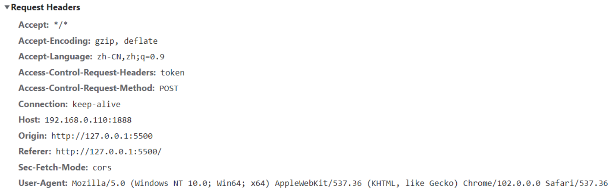
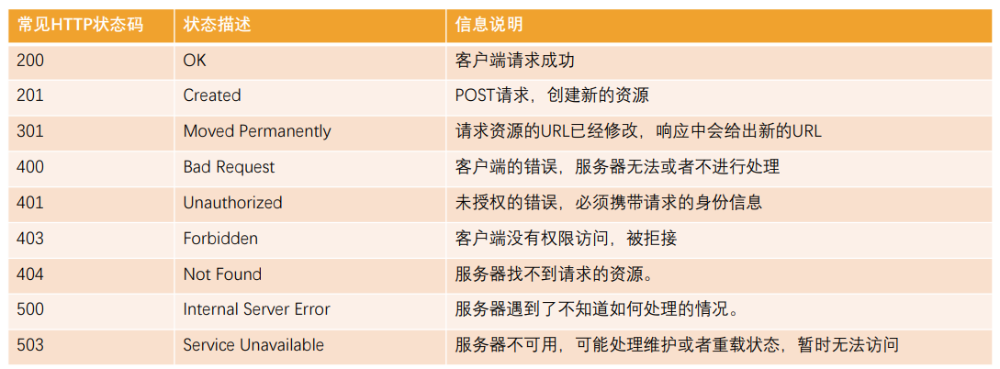
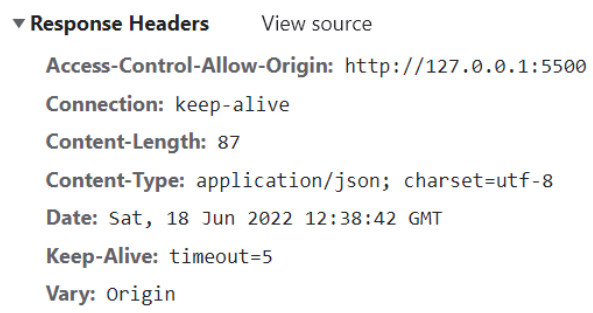
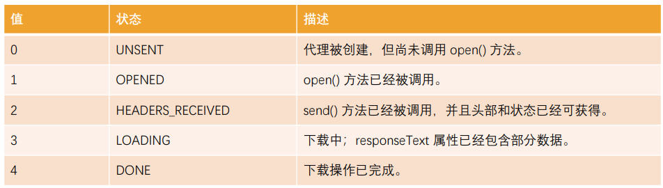

# 14 JavaScript网络编程

## 前后端分离与服务器端渲染

### 服务器端渲染

早期的网页都是通过后端渲染来完成的：**服务器端渲染（SSR，server side render）**，即客户端发出请求 -> 服务端接收请求并返回相应HTML文档（index.html） -> 页面刷新，客户端加载新的HTML文档


### 服务器端渲染的缺点

- 当用户点击页面中的某个按钮向服务器发送请求时，页面本质上只是一些数据发生了变化，而此时服务器却要将重绘的整个页面再返回给浏览器加载
- 同时，虽然只是一些数据的变化却迫使服务器要返回整个HTML文档，这本身也会给网络带宽带来不必要的开销

### Ajax与前后端分离

为解决服务器端渲染的弊端，即在页面数据变动时，只向服务器请求新的数据，并且在阻止页面刷新的情况下，动态的替换页面中展示的数据的技术是 **Ajax（Asynchronous JavaScript And XML，异步的JavaScript和XML）**


## http

### http的基本概念

超文本传输协议（HyperText Transfer Protocol，http）是一种用于分布式、协作式和超媒体信息系统的应用层协议

- http是万维网的数据通信的基础，设计http最初的目的是为了提供一种发布和接收HTML页面的方法
- 通过http或者https协议请求的资源由统一资源标识符（Uniform Resource Identifiers，URI）来标识 => 网页里面就是URL

**http是一个客户端（用户）和服务端（网站）之间==请求和响应==的标准** 

- 通过使用网页浏览器、网络爬虫或者其它的工具，客户端发起一个http请求到服务器上指定端口（默认端口为80），称这个客户端为**用户代理程序（user agent）**

- 响应的服务器上存储着一些资源，比如html文件和图像，称这个响应服务器为**源服务器（origin server）**


### http的组成

**一次http请求主要包括：请求（Request）和响应（Response）**


### http的版本

- HTTP/0.9（1991）：只支持GET请求获取文本数据，当时主要是为了获取HTML页面内容
- HTTP/1.0（1996）：支持POST、HEAD等请求方法，支持请求头、响应头等，支持更多种数据类型（不再局限于文本数据），但是浏览器的每次请求都需要与服务器建立一个TCP连接，请求处理完成后立即断开TCP连接，每次建立连接增加了性能损耗
- HTTP/1.1（1997）【目前使用最广泛的版本】：增加了PUT、DELETE等请求方法，采用持久连接(Connection: keep-alive)，即多个请求可以共用同一个TCP连接
- HTTP/2.0（2015）
- HTTP/3.0（2018）

### http的请求方式

- **GET**：GET 方法请求一个指定资源的表示形式，使用 GET 的请求应该只被用于获取数据
- HEAD：HEAD 方法请求一个与 GET 请求的响应相同的响应，但没有响应体。比如在准备下载一个文件前，先获取文件的大小，再决定是否进行下载
- **POST**：POST 方法用于将实体提交到指定的资源。
- PUT：PUT 方法用请求有效载荷（payload）替换目标资源的所有当前表示
- **DELETE**：DELETE 方法删除指定的资源
- **PATCH**：PATCH 方法用于对资源部分修改
- CONNECT：CONNECT 方法建立一个到目标资源标识的服务器的隧道，通常用在代理服务器，网页开发很少用到
- TRACE：TRACE 方法沿着到目标资源的路径执行一个消息环回测试

### Request Headers

在request对象的headers中也包含很多有用的信息，客户端会默认传递过来一些信息：



- **★content-type**：请求携带的数据的类型
  - application/x-www-form-urlencoded：表示数据被编码成以 '&' 分隔的键 - 值对，同时以 '=' 分隔键和值 
  - application/json：表示是一个json类型
  - text/plain：表示是文本类型
  - application/xml：表示是xml类型
  - multipart/form-data：表示是上传文件
- **content-length**：文件的大小长度
- **keep-alive**：
  - http是基于TCP协议的，但是通常在进行一次请求和响应结束后会立刻中断
  - 在http1.0中，如果想要继续保持连接：浏览器需要在请求头中添加 connection: keep-alive；服务器需要在响应头中添加 connection: keep-alive；客户端再次放请求时，就会使用同一个连接，直接一方中断连接
  - 在http1.1中，所有连接默认是 connection: keep-alive的
  - 不同的Web服务器会有不同的保持 keep-alive的时间（Node中默认是5s）
- **accept-encoding**：告知服务器，客户端支持的文件压缩格式，比如js文件可以使用gzip编码，对应 .gz文件
- **accept**：告知服务器，客户端可接受文件的格式类型【\*/\* 代表任意格式】
- **user-agent**：客户端相关的信息

### 响应状态码

http状态码（http Status Code）是用来表示Http响应状态的数字代码：http状态码非常多，可以根据不同的情况，给客户端返回不同的状态码

MDN响应码解析地址：https://developer.mozilla.org/zh-CN/docs/web/http/status

常见的响应状态码：



### Response Headers

响应的header中包括一些服务器给客户端的信息：




## XHR

### 使用Ajax发送请求

Ajax 是异步的 JavaScript 和 XML（Asynchronous JavaScript And XML），它可以使用 JSON，XML，HTML 和 text 文本等格式发送和接收数据

完成AJAX请求的步骤：

- 第一步：创建网络请求的Ajax对象（使用**XMLHttpRequest**）
- 第二步：监听XMLHttpRequest对象状态的变化，或者监听onload事件（请求完成时触发）
- 第三步：配置网络请求（通过open方法）
- 第四步：发送send网络请求

```js
// 1.创建XMLHttpRequest对象
const xhr = new XMLHttpRequest()

// 2.监听状态的改变(宏任务)
xhr.onreadystatechange = function() {
  // console.log(xhr.response)
  if (xhr.readyState !== XMLHttpRequest.DONE) return
  // 将字符串转成JSON对象(js对象)
  const resJSON = JSON.parse(xhr.response)
  // 后续处理。。。
}

// 3.配置请求open
// method: 请求的方式(get/post/delete/put/patch...)
// url: 请求的地址
xhr.open("get", "http://123.207.32.32:8000/home/multidata")

// 4.发送请求(浏览器帮助发送对应请求)
xhr.send()
```

### XMLHttpRequest中的state

在一次网络请求中状态发生了很多次变化，对于一次请求来说包括如下的状态：



```js
if (xhr.readyState !== XMLHttpRequest.DONE) return   // 4
```

注意：这个状态并非是http的响应状态，而是记录的XMLHttpRequest对象的状态变化【http响应状态通过status和statusText获取】

```js
console.log(xhr.status)  // 200
console.log(xhr.statusText)  // OK
```

### 发送同步请求

==与异步的区别：是否会阻塞后续代码的执行==

默认的请求形式是**异步**的

发送同步请求的方式：

```js
xhr.open("get", "http://123.207.32.32:8000/home/multidata", false)
```

同步必须等到有结果后，才会继续执行后续代码。因此，在开发中要使用异步请求

### XMLHttpRequest其他事件监听

- loadstart：请求开始
- progress： 一个响应数据包到达，此时整个 response body 都在 response 中
- abort：调用 `xhr.abort() `取消了请求
- error：发生连接错误，例如，域错误。不会发生诸如 404 这类的 HTTP 错误
- load：请求成功完成【也可以使用onload来获取数据】

```js
xhr.onload = () => {
  console.log(xhr.response)
}
```

- timeout：由于请求超时而取消了该请求（仅发生在设置了 timeout 的情况下）
- loadend：在 load，error，timeout 或 abort 之后触发

### 响应数据和响应类型

一般情况下，绝大多数接口返回的响应数据都是JSON格式的，而responseType会被默认设置为空字符串（也就是将**text**作为默认值），可以通过设置responseType的方式直接将其按照JSON进行解析

```js
// 1.
const xhr = new XMLHttpRequest()

// 2.onload监听数据加载完成
xhr.onload = function() {
  console.log(xhr.response)
  // console.log(xhr.responseText)
  // console.log(xhr.responseXML)
}

// 3.告知xhr获取到的数据的类型
xhr.responseType = "json"
// xhr.responseType = "xml"

// 4.配置网络请求 json类型的接口
xhr.open("get", "http://123.207.32.32:8000/home/multidata")
// text类型的接口
// xhr.open("get", "http://123.207.32.32:1888/01_basic/hello_text")
// xml类型的接口
// xhr.open("get", "http://123.207.32.32:1888/01_basic/hello_xml")

// 5.发送网络请求
xhr.send()
```

而早期通常服务器返回的数据是普通的文本和XML，所以通常会通过responseText、 responseXML来获取响应结果，之后再将它们转化成JavaScript对象形式【目前服务器基本返回的都是json数据，直接设置为json即可】


## XHR进阶

### GET/POST请求传递参数

常见的传递给服务器数据的方式有如下几种：

- ★方式一：GET请求的query参数

```js
xhr.open("get", "http://123.207.32.32:1888/02_param/get?name=why&age=18&address=广州市")
```

- 方式二：POST请求 x-www-form-urlencoded 格式

```js
xhr.open("post", "http://123.207.32.32:1888/02_param/posturl")
// 发送请求(请求体body)
xhr.setRequestHeader("Content-type", "application/x-www-form-urlencoded")
xhr.send("name=why&age=18&address=广州市")
```

- 方式三：POST请求 FormData 格式

```js
xhr.open("post", "http://123.207.32.32:1888/02_param/postform")
// formElement对象转成FormData对象
const formData = new FormData(formEl)  // <form>表单元素
xhr.send(formData)
```

- ★方式四：POST请求 JSON 格式

```js
xhr.open("post", "http://123.207.32.32:1888/02_param/postjson")
xhr.setRequestHeader("Content-type", "application/json")
xhr.send(JSON.stringify({name: "why", age: 18, height: 1.88}))  // 对象->string
```

### Ajax网络请求封装


## Fetch


## 前端实现文件上传

