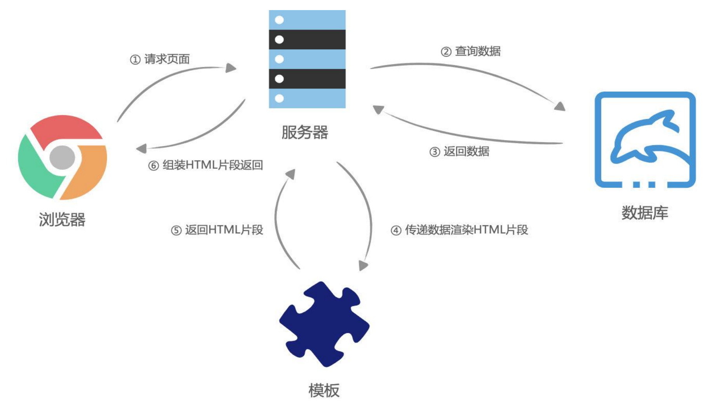
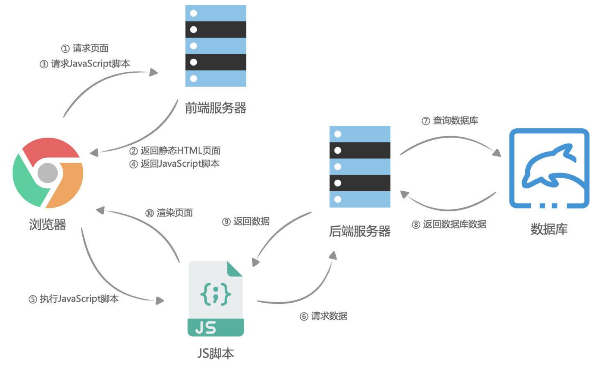
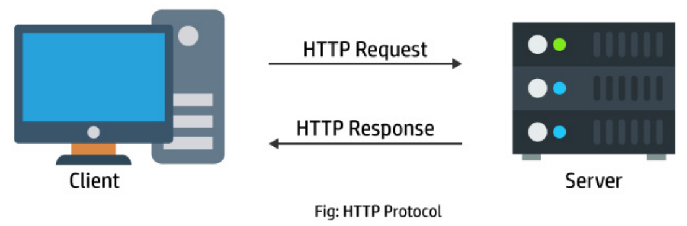
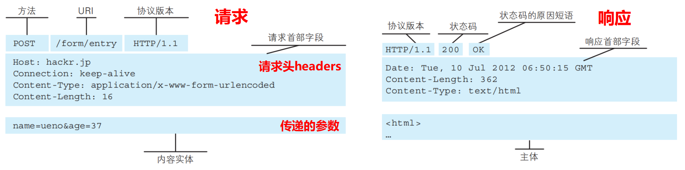

# 14 JavaScript网络编程

## 前后端分离与服务器端渲染

### 服务器端渲染

早期的网页都是通过后端渲染来完成的：**服务器端渲染（SSR，server side render）**，即客户端发出请求 -> 服务端接收请求并返回相应HTML文档（index.html） -> 页面刷新，客户端加载新的HTML文档

### 服务器端渲染的缺点

- 当用户点击页面中的某个按钮向服务器发送请求时，页面本质上只是一些数据发生了变化，而此时服务器却要将重绘的整个页面再返回给浏览器加载
- 同时，虽然只是一些数据的变化却迫使服务器要返回整个HTML文档，这本身也会给网络带宽带来不必要的开销

### Ajax与前后端分离

为解决服务器端渲染的弊端，即在页面数据变动时，只向服务器请求新的数据，并且在阻止页面刷新的情况下，动态的替换页面中展示的数据的技术是 **Ajax（Asynchronous JavaScript And XML，异步的JavaScript和XML）**

## http

### http的基本概念

超文本传输协议（HyperText Transfer Protocol，http）是一种用于分布式、协作式和超媒体信息系统的应用层协议

- http是万维网的数据通信的基础，设计http最初的目的是为了提供一种发布和接收HTML页面的方法
- 通过http或者https协议请求的资源由统一资源标识符（Uniform Resource Identifiers，URI）来标识 => 网页里面就是URL

**http是一个客户端（用户）和服务端（网站）之间==请求和响应==的标准** 

- 通过使用网页浏览器、网络爬虫或者其它的工具，客户端发起一个http请求到服务器上指定端口（默认端口为80），称这个客户端为**用户代理程序（user agent）**

- 响应的服务器上存储着一些资源，比如html文件和图像，称这个响应服务器为**源服务器（origin server）**

### http的组成

**一次http请求主要包括：请求（Request）和响应（Response）**

### http的版本

- HTTP/0.9（1991）：只支持GET请求获取文本数据，当时主要是为了获取HTML页面内容
- HTTP/1.0（1996）：支持POST、HEAD等请求方法，支持请求头、响应头等，支持更多种数据类型（不再局限于文本数据），但是浏览器的每次请求都需要与服务器建立一个TCP连接，请求处理完成后立即断开TCP连接，每次建立连接增加了性能损耗
- HTTP/1.1（1997）【目前使用最广泛的版本】：增加了PUT、DELETE等请求方法，采用持久连接(Connection: keep-alive)，即多个请求可以共用同一个TCP连接
- HTTP/2.0（2015）
- HTTP/3.0（2018）

### http的请求方式

## XHR

## Fetch

## 前端实现文件上传

