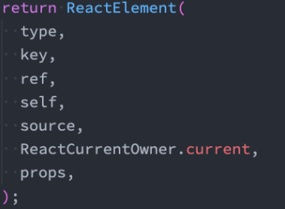
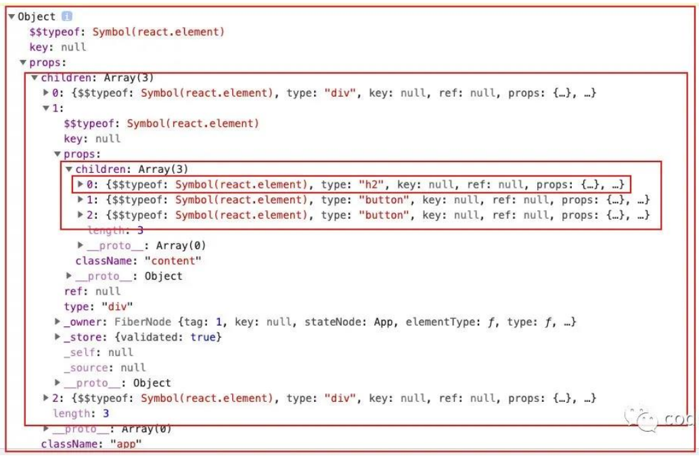
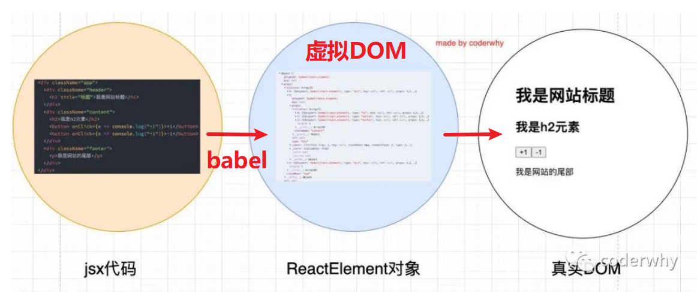
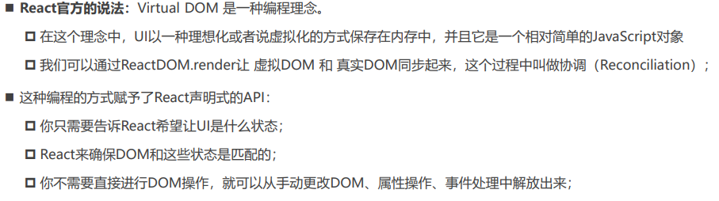

# 02 jsx语法

## 一、认识jsx

### 什么是jsx

jsx是一种JavaScript的语法扩展（eXtension），也在很多地方称之为JavaScript XML（因为看起就是一段XML语法）

它用于描述我们的UI界面，并且其完成可以和JavaScript融合在一起使用

它不同于Vue中的模块语法，不需要专门学习模块语法中的一些指令（如v-for、v-if、v-else、v-bind）

### React为什么选择jsx

React认为渲染逻辑本质上与其他UI逻辑存在内在耦合：**html in js**

- 比如UI需要绑定事件（button、a原生等等）
- 比如UI中需要展示数据状态
- 比如在某些状态发生改变时，又需要改变UI

渲染逻辑与UI逻辑之间是密不可分，所以React没有将标记分离到不同的文件中，而是将它们组合到了一起，这就是组件（Component）


## 二、jsx的基本使用

### jsx书写规范

- jsx的顶层**只能有一个根元素**，因此一般在最外层包裹一个div元素（或者使用Fragment）
- 为了方便阅读，我们通常在jsx的外层包裹一个小括号()，这样可以方便阅读，并且jsx可以进行换行书写
- jsx中的标签可以是单标签，也可以是双标签【注意：如果是单标签，必须以/>结尾】

### 注释

```jsx
render() {
  // 1.state的解构, 获取到message
  const { message } = this.state

  return (
    <div>
      { /* JSX的注释写法 */ }
      <h2>{message}</h2>
    </div>
  )
}
```

### jsx嵌入变量

- **情况一**：当变量是Number、String、Array类型时，可以直接显示
- **情况二**：当变量是null、undefined、Boolean类型时，内容为空（界面不会显示）
    - 如果希望可以显示null、undefined、Boolean，那么需要转成字符串
    - 转换的方式有很多，比如toString方法、和空字符串拼接，String(变量)等方式
- **情况三**：Object对象类型不能作为子元素（not valid as a React child）

### jsx嵌入表达式

```jsx
{/* 插入表达式 */}
<h2>{10 + 20}</h2>
<h2>{firstName + " " + lastName}</h2>
{/* 三元运算符 */}
<h2>{age >= 18 ? "成年人": "未成年人"}</h2>
{/* 调用方法获取结果 */}
<ul>{this.state.movies.map(movie => <li>{movie}</li>)}</ul>
<ul>{this.getMovieEls()}</ul>
```

### jsx绑定属性

在开发中，经常需要绑定src（img）、href（a）、class、style等属性

#### 绑定 class

**注意：绑定class属性时最好使用className**

```jsx
// 1.class绑定的写法一: 字符串的拼接
const className = `abc cba ${isActive ? 'active': ''}`
// 2.class绑定的写法二: 将所有的class放到数组中
const classList = ["abc", "cba"]
if (isActive) classList.push("active")
// 3.class绑定的写法三: 第三方库classnames -> npm install classnames

return (
  <div>
    <a href={href}>百度一下</a>
    <h2 className={className}>哈哈哈哈</h2>
    <h2 className={classList.join(" ")}>哈哈哈哈</h2>
  </div>
)
```

#### 绑定 style

**注意：写css时需要写成驼峰的形式**

```jsx
const objStyle = {color: "red", fontSize: "30px"}

return (
  <div>
    <h2 style={{color: "red", fontSize: "30px"}}>呵呵呵呵</h2>
    <h2 style={objStyle}>呵呵呵呵</h2>
  </div>
)
```


## 三、jsx的事件绑定

在React中进行事件监听的注意点：

-  事件的命名采用小驼峰式（camelCase），而不是纯小写
- 需要通过{}传入一个事件处理函数，这个函数会在事件发生时被执行【eg.  `onClick={btnClick}`】

### this的绑定问题

在事件执行后，我们可能需要获取当前类的对象中相关的属性，这个时候需要用到`this`，而这里的`this`是undefined

- btnClick函数并不是我们主动调用的，而是当button发生改变时，React内部调用了btnClick函数。而在它内部调用时，并没有绑定正确的this

**解决方案**：

方案一：bind给btnClick显示绑定this

方案二：使用 ES6 class fields 语法

方案三：事件监听时传入箭头函数（★）

> `this.btn3Click()`执行函数，绑定`this`到组件（隐式绑定）

```jsx
class App extends React.Component {
  // 2.this绑定方式二: ES6 class fields
  name = "App"

  constructor() {
    super()
    this.state = {...}
    // 1. this绑定方式一: bind绑定
    this.btn1Click = this.btn1Click.bind(this)
  }
  btn1Click() {...}
  btn2Click = () => {...}
  btn3Click = () => {...}

  render() {
    const { message } = this.state
    return (
      <div>
        {/* 1.this绑定方式一: bind绑定 */}
        <button onClick={this.btn1Click}>按钮1</button>  
        {/* 2.this绑定方式二: ES6 class fields */}
        <button onClick={this.btn2Click}>按钮2</button>
        {/* 3.this绑定方式三: 直接传入一个箭头函数(★) */}
        <button onClick={() => this.btn3Click()}>按钮3</button>
      </div>
    )
  }
}
```

### 事件参数传递

在执行事件函数时，有可能我们需要获取一些参数信息：比如event对象、其他参数等

**情况一：获取event对象**

我们可能需要拿到event对象来做一些事情（比如阻止默认行为），那么默认情况下，event对象有被直接传入，函数就可以获取到event对象

```jsx
btnClick(event) {
  console.log("btnClick:", event)
}

<button onClick={(event) => this.btnClick(event)}>按钮4</button>
```

**情况二：获取更多参数**

有更多参数时，最好的方式是传入一个箭头函数【bind绑定会有顺序问题】，主动执行的事件函数，并且传入相关的其他参数

```jsx
btnClick(event, name, age) {
  console.log("name, age:", name, age)
}

<button onClick={(event) => this.btnClick(event, "why", 18)}>按钮4</button>
```


## 四、 jsx的条件渲染

Vue中的条件渲染：`v-if`, `v-show`

React中的条件渲染：`if`

常见的条件渲染方式（`v-if`）：

- `if`语句
- 三元运算符 

```jsx
<div>{ isReady ? <button>start</button> : <button>end</button>}</div>
```

- 与运算符`&&`（当某一个值，有可能为undefined时，使用&&进行条件判断）

```jsx
<div>{ friend && <div>{friend.name}</div> }</div>
```

如果要实现`v-show`的操作，直接操作css的display属性即可

```jsx
<h2 style={{display: isShow ? 'block': 'none'}}>哈哈哈哈</h2>
```


## 五、jsx的列表渲染

Vue中的列表渲染：`v-for`

React中的列表渲染：普通`for`循环和高阶数组函数

常用高阶函数：

- map（★）

```jsx
students.map(item => {
  return (
    <div className="item" key={item.id}>
      <h2>学号: {item.id}</h2>
      <h3>姓名: {item.name}</h3>
      <h1>分数: {item.score}</h1>
    </div>
  )
})
```

- filter

```jsx
const filterStudents = students.filter(item => {
  return item.score > 100
})
```

- slice

```jsx
// slice(start, end): [start, end)
const sliceStudents = filterStudents.slice(0, 2)
```

### 列表中的key

列表渲染的jsx中需要添加一个key，主要目的：提高diff算法的效率

```jsx
return (
    <div className="item" key={item.id}>
      <h3>姓名: {item.name}</h3>
    </div>
  )
```


## 六、jsx的原理和本质

### React.createElement

实际上，jsx 仅仅只是 `React.createElement(component, props, ...children) `函数的语法糖，所有的jsx最终都会通过babel被转换成`React.createElement`的函数调用

`React.createElement`需要传递三个参数：

- type：当前`ReactElement`的类型

如果是标签元素，那么就使用字符串表示 “div”；如果是组件元素，那么就直接使用组件的名称 "Children"

- config

所有jsx中的属性（如class、id...）都在config中以**对象的属性和值**的形式存储（比如传入className作为元素的class；）

- children

存放在标签中的内容，以children数组的方式进行存储。如果是多个元素，React内部会对其进行处理（本质是形成树的结构）

```jsx
// jsx
<div>
  <div className="header">Header</div>
  <div className="Content">
    <div>{message}</div>
    <ul>
      <li>列表数据1</li>
      <li>列表数据2</li>
      <li>列表数据3</li>
      <li>列表数据4</li>
      <li>列表数据5</li>
    </ul>
  </div>
  <div className="footer">Footer</div>
</div>
```

```jsx
// jsx -babel> js
const element = React.createElement(
  "div",
  null,
/*#__PURE__*/ React.createElement(
    "div",
    {
      className: "header"
    },
    "Header"
  ),
/*#__PURE__*/ React.createElement(
    "div",
    {
      className: "Content"
    },
/*#__PURE__*/ React.createElement("div", null, "Banner"),
/*#__PURE__*/ React.createElement(
      "ul",
      null,
/*#__PURE__*/ React.createElement(
        "li",
        null,
        "\u5217\u8868\u6570\u636E1"
      ),
/*#__PURE__*/ React.createElement(
        "li",
        null,
        "\u5217\u8868\u6570\u636E2"
      ),
/*#__PURE__*/ React.createElement(
        "li",
        null,
        "\u5217\u8868\u6570\u636E3"
      ),
/*#__PURE__*/ React.createElement(
        "li",
        null,
        "\u5217\u8868\u6570\u636E4"
      ),
/*#__PURE__*/ React.createElement("li", null, "\u5217\u8868\u6570\u636E5")
    )
  ),
/*#__PURE__*/ React.createElement(
    "div",
    {
      className: "footer"
    },
    "Footer"
  )
);
```

### 虚拟DOM

通过 `React.createElement` 最终创建出来一个 `ReactElement` 对象（js对象，一个虚拟节点）



React利用`ReactElement`对象组成了一个**JavaScript的对象树**，称该对象树为**虚拟DOM（Virtual DOM）**

查看`ReactElement`树结构的方式：打印jsx经babel转换后的element





### 声明式编程

 虚拟DOM帮助我们从**命令式编程**转到了**声明式编程**的模式


