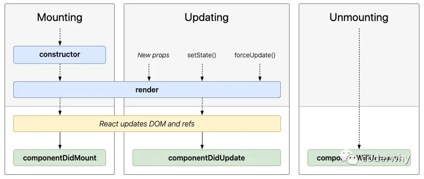

# 03 React组件化开发

## 一、React的组件化

React组件相对于Vue更加灵活多样：

- **★按组件定义方式**：**函数组件【hooks】（Functional Component）和类组件（Class Component）**
- 根据组件内部是否有状态需要维护：无状态组件（Stateless Component ）和有状态组件（Stateful Component）【flutter】
- 根据组件职责：展示型组件（Presentational Component）和容器型组件（Container Component）

>函数组件、无状态组件、展示型组件主要关注UI的展示
>
>类组件、有状态组件、容器型组件主要关注数据逻辑

- 还有其他组件：如异步组件、高阶组件......

### 类组件

类组件的定义有如下要求：

- 组件的名称是大写字符开头（无论类组件还是函数组件）
- 类组件需要继承自 `React.Component`
- 类组件必须实现render函数

在ES6之后，类组件一般使用`class`定义

> 注意：
>
> - `constructor`是可选的，通常在constructor中初始化一些数据
> - `this.state`中维护的就是组件内部的数据

```jsx
import React from 'react'

class App extends React.Component {
  constructor() {
    super()
    this.state = {
      message: 'Hello React!',
    }
  }
  render() {
    const { message } = this.state
    return <h1>{message}</h1>
  }
}
export default App
```

### render函数返回值

当 `render()` 被调用时，它会检查 `this.props` 和 `this.state` 的变化（通过`setState`进行的修改）并返回以下类型之一：

- **React元素**
    - 通常通过 jsx 创建出来的都是React元素
    - 例如，<div /> 会被 React 渲染为 DOM 节点，<MyComponent /> 会被 React 渲染为自定义组件
- **数组或** **fragments**：使得 render 方法可以返回多个元素
- **Portals**：可以渲染子节点到不同的 DOM 子树中
- **字符串或数值类型**：它们在 DOM 中会被渲染为文本节点
- **布尔类型、null、undefined**：什么都不渲染

### 函数组件

函数组件是使用`function`来进行定义的函数，这个函数会返回和类组件中render函数返回一样的内容

函数组件有以下特点【在无hooks时】：

- 没有生命周期，也会被更新并挂载，但是没有生命周期函数
- `this`不能指向组件实例（因为没有组件实例）
- 没有内部状态（state）

```jsx
function App() {
  return (
    <div>
      <h1>Hello, React!</h1>
    </div>
  )
}
export default App
```


## 二、生命周期

### 生命周期的定义

从创建到销毁的整个过程，这个过程称为是**生命周期**，生命周期的主要三阶段：1）挂载 Mount；2）更新 Update；3）卸载 unMount

React内部会对我们组件内部实现的某些函数进行回调，这些函数就是**生命周期函数**

> 注意：谈到React生命周期，基本指的是类组件的生命周期，因为函数式组件在没有hooks模拟时没有生命周期

### 生命周期函数



#### **Constructor**

constructor中通常只做两件事情：通过给 `this.state` 赋值对象来初始化内部的state；为事件绑定实例（`this`）

> 注意：如果不初始化 state 或不进行方法`this`绑定，可以不需要为 React 组件实现constructor

#### **componentDidMount**

`componentDidMount()` 会在组件挂载后（插入 DOM 树中）立即调用

其中通常进行以下操作：

- 依赖于DOM的操作
- **发送网络请求（★）**
- 添加订阅（在`componentWillUnmount`取消订阅）

#### **componentDidUpdate**

`componentDidUpdate()` 会在更新后会被立即调用，首次渲染不会执行此方法

当组件更新后，可以在此处对 DOM 进行操作

> 注：如果对更新前后的 props 进行了比较，也可以选择在此处进行网络请求（例如，当 props 未发生变化时，则不会执行网络请求）

#### **componentWillUnmount**

`componentWillUnmount() `会在组件卸载及销毁之前直接调用

此方法中主要执行必要的清理操作，例如：清除 timer，取消网络请求或清除在 `componentDidMount()` 中创建的订阅等

#### **不常用的生命周期函数**


**getDerivedStateFromProps**：state 的值在任何时候都依赖于 props 时使用；该方法返回一个对象来更新state

**getSnapshotBeforeUpdate**：在React更新DOM之前回调的一个函数，可以获取DOM更新前的一些信息（比如说滚动位置）

**shouldComponentUpdate**（✔）：是否在update时执行render函数，主要在性能优化时使用


## 三、组件通信

### ★父传子

- 父组件通过 **属性=值** 的形式来传递给子组件数据（与Vue类似）
- 子组件通过 **props 参数**获取父组件传递过来的数据

```jsx
// 父 Main.jsx
render() {
  const { banners, productList } = this.state
  return (
    <div className='main'>
      <MainBanner banners={banners} title="轮播图"/>
    </div>
  )
}
```

```jsx
// 子 MainBanner.jsx
// 当子组件没有自己的state时, 可以省略constructor
constructor(props) {
  super(props)  // props为一个对象 {banners:[...], title="..."}
}
render() {
  const { title, banners } = this.props  // this.props取到数据
  return (
    <div>
      <h2>{title}</h2>
      <ul>
        {
          banners.map((item, index) => {
            return <li key={index}>{item}</li>
          })
        }
      </ul>
    </div>
  )
}
```

### 子组件中指定props类型

在父传子中，如果传递的数据类型错误，可能导致代码报错（如undefined无法map）

- **prop-types**

```jsx
import PropTypes from 'prop-types'
。。。
MainBanner.propTypes = {
  banners: PropTypes.array.isRequired,
  title: PropTypes.string
}
MainBanner.defaultProps = {
  banners: [],
  title: '默认标题'
}
```

实际开发中，未必一定要写【对于js项目】；而对于ts项目，直接使用ts即可

更多验证方式：https://www.npmjs.com/package/prop-types

- static propTypes

在ES2022后，可以定义 `static propTypes` 和`prop-types`库来声明组件可接受的 props 类型

```jsx
import PropTypes from 'prop-types'

class Greeting extends React.Component {
  static propTypes = {
    name: PropTypes.string
  }
  static defaultProps = {
    name: 'default'
  }

  render() {
    return (
      <h1>Hello, {this.props.name}</h1>
    )
  }
}
```

### ★子传父

- Vue中子传父是通过自定义事件完成的
- React中通过 **props** 传递消息，父组件给子组件传递一个回调函数，在子组件中调用这个函数即可

```jsx
// 父 App.jsx
export class App extends Component {
  constructor() {
    super()
    this.state = {
      counter: 100,
    }
  }

  changeCounter(count) {
    this.setState({
      counter: this.state.counter + count,
    })
  }

  render() {
    const { counter } = this.state
    return (
        <div>
          <h2>{counter}</h2>
          <AddCounter addClick={(count) => {this.changeCounter(count)}} />
        </div>
      )
  }
}
```

```jsx
// 子 AddCounter.jsx
export class AddCounter extends Component {
  addCount(count) {
    this.props.addClick(count) // 拿到props
  }

  render() {
    return (
      <div>
        <button onClick={() => this.addCount(5)}>+5</button>
        <button onClick={() => this.addCount(10)}>+10</button>
      </div>
    )
  }
}
```


## 四、插槽


## 五、非父子通信


## 六、setState使用详解

