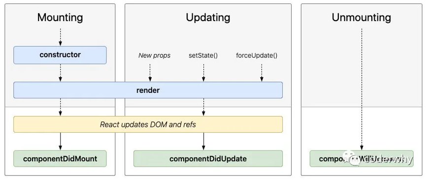
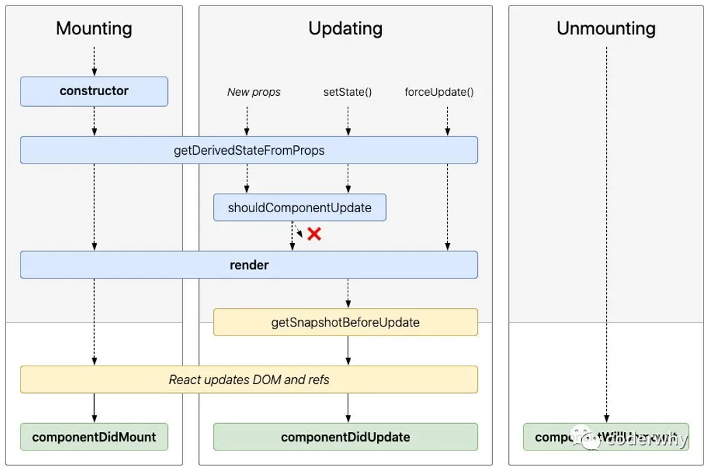

# 03 React组件化开发（一）

## 一、React的组件化

React组件相对于Vue更加灵活多样：

- **★按组件定义方式**：**函数组件【hooks】（Functional Component）和类组件（Class Component）**
- 根据组件内部是否有状态需要维护：无状态组件（Stateless Component ）和有状态组件（Stateful Component）【flutter】
- 根据组件职责：展示型组件（Presentational Component）和容器型组件（Container Component）

>函数组件、无状态组件、展示型组件主要关注UI的展示
>
>类组件、有状态组件、容器型组件主要关注数据逻辑

- 还有其他组件：如异步组件、高阶组件......

### 类组件

类组件的定义有如下要求：

- 组件的名称是大写字符开头（无论类组件还是函数组件）
- 类组件需要继承自 `React.Component`
- 类组件必须实现render函数

在ES6之后，类组件一般使用`class`定义

> 注意：
>
> - `constructor`是可选的，通常在constructor中初始化一些数据
> - `this.state`中维护的就是组件内部的数据

```jsx
import React from 'react'

class App extends React.Component {
  constructor() {
    super()
    this.state = {
      message: 'Hello React!',
    }
  }
  render() {
    const { message } = this.state
    return <h1>{message}</h1>
  }
}
export default App
```

### render函数返回值

当 `render()` 被调用时，它会检查 `this.props` 和 `this.state` 的变化（通过`setState`进行的修改）并返回以下类型之一：

- **React元素**
    - 通常通过 jsx 创建出来的都是React元素
    - 例如，<div /> 会被 React 渲染为 DOM 节点，<MyComponent /> 会被 React 渲染为自定义组件
- **数组或** **fragments**：使得 render 方法可以返回多个元素
- **Portals**：可以渲染子节点到不同的 DOM 子树中
- **字符串或数值类型**：它们在 DOM 中会被渲染为文本节点
- **布尔类型、null、undefined**：什么都不渲染

### 函数组件

函数组件是使用`function`来进行定义的函数，这个函数会返回和类组件中render函数返回一样的内容

函数组件有以下特点【在无hooks时】：

- 没有生命周期，也会被更新并挂载，但是没有生命周期函数
- `this`不能指向组件实例（因为没有组件实例）
- 没有内部状态（state）

```jsx
function App() {
  return (
    <div>
      <h1>Hello, React!</h1>
    </div>
  )
}
export default App
```


## 二、生命周期

### 生命周期的定义

从创建到销毁的整个过程，这个过程称为是**生命周期**，生命周期的主要三阶段：1）挂载 Mount；2）更新 Update；3）卸载 unMount

React内部会对我们组件内部实现的某些函数进行回调，这些函数就是**生命周期函数**

> 注意：谈到React生命周期，基本指的是类组件的生命周期，因为函数式组件在没有hooks模拟时没有生命周期

### 生命周期函数



#### **Constructor**

constructor中通常只做两件事情：通过给 `this.state` 赋值对象来初始化内部的state；为事件绑定实例（`this`）

> 注意：如果不初始化 state 或不进行方法`this`绑定，可以不需要为 React 组件实现constructor

#### **componentDidMount**

`componentDidMount()` 会在组件挂载后（插入 DOM 树中）立即调用

其中通常进行以下操作：

- 依赖于DOM的操作
- **发送网络请求（★）**
- 添加订阅（在`componentWillUnmount`取消订阅）

#### **componentDidUpdate**

`componentDidUpdate()` 会在更新后会被立即调用，首次渲染不会执行此方法

当组件更新后，可以在此处对 DOM 进行操作

> 注：如果对更新前后的 props 进行了比较，也可以选择在此处进行网络请求（例如，当 props 未发生变化时，则不会执行网络请求）

#### **componentWillUnmount**

`componentWillUnmount() `会在组件卸载及销毁之前直接调用

此方法中主要执行必要的清理操作，例如：清除 timer，取消网络请求或清除在 `componentDidMount()` 中创建的订阅等

#### **不常用的生命周期函数**



**getDerivedStateFromProps**：state 的值在任何时候都依赖于 props 时使用；该方法返回一个对象来更新state

**getSnapshotBeforeUpdate**：在React更新DOM之前回调的一个函数，可以获取DOM更新前的一些信息（比如说滚动位置）

**shouldComponentUpdate**（✔）：是否在update时执行render函数，主要在性能优化时使用


## 三、组件通信

### ★父传子

- 父组件通过 **属性=值** 的形式来传递给子组件数据（与Vue类似）
- 子组件通过 **props 参数**获取父组件传递过来的数据

```jsx
// 父 Main.jsx
render() {
  const { banners, title } = this.state.info
  // info = {banners:..., title:...}
  const { info } = this.state
  return (
    <div className='main'>
      { /*以下两种写法等价*/ }
      <MainBanner banners={banners} title={title}/>
      <MainBanner {...info}/>
    </div>
  )
}
```

```jsx
// 子 MainBanner.jsx
// 当子组件没有自己的state时, 可以省略constructor
constructor(props) {
  super(props)  // props为一个对象 {banners:[...], title="..."}
}
render() {
  const { title, banners } = this.props  // this.props取到数据
  return (
    <div>
      <h2>{title}</h2>
      <ul>
        {
          banners.map((item, index) => {
            return <li key={index}>{item}</li>
          })
        }
      </ul>
    </div>
  )
}
```

### 子组件中指定props类型

在父传子中，如果传递的数据类型错误，可能导致代码报错（如undefined无法map）

- **prop-types**

```jsx
import PropTypes from 'prop-types'
。。。
MainBanner.propTypes = {
  banners: PropTypes.array.isRequired,
  title: PropTypes.string
}
MainBanner.defaultProps = {
  banners: [],
  title: '默认标题'
}
```

实际开发中，未必一定要写【对于js项目】；而对于ts项目，直接使用ts即可

更多验证方式：https://www.npmjs.com/package/prop-types

- static propTypes

在ES2022后，可以定义 `static propTypes` 和`prop-types`库来声明组件可接受的 props 类型

```jsx
import PropTypes from 'prop-types'

class Greeting extends React.Component {
  static propTypes = {
    name: PropTypes.string
  }
  static defaultProps = {
    name: 'default'
  }

  render() {
    return (
      <h1>Hello, {this.props.name}</h1>
    )
  }
}
```

### ★子传父

- Vue中子传父是通过自定义事件完成的
- React中通过 **props** 传递消息，父组件给子组件传递一个回调函数，在子组件中调用这个函数即可

```jsx
// 父 App.jsx
export class App extends Component {
  constructor() {
    super()
    this.state = {
      counter: 100,
    }
  }

  changeCounter(count) {
    this.setState({
      counter: this.state.counter + count,
    })
  }

  render() {
    const { counter } = this.state
    return (
        <div>
          <h2>{counter}</h2>
          <AddCounter addClick={(count) => {this.changeCounter(count)}} />
        </div>
      )
  }
}
```

```jsx
// 子 AddCounter.jsx
export class AddCounter extends Component {
  addCount(count) {
    this.props.addClick(count) // 拿到props
  }

  render() {
    return (
      <div>
        <button onClick={() => this.addCount(5)}>+5</button>
        <button onClick={() => this.addCount(10)}>+10</button>
      </div>
    )
  }
}
```

### 插槽 slot

在开发中，我们抽取了一个组件，但是为了让这个组件具备更强的通用性，我们不能将组件中的内容限制为固定的div、span等元素，**我们应该让使用者可以决定某一块区域到底存放什么内容**

这样的需求在Vue中通过插槽 slot完成，而在React中【**先明确React没有插槽**（其实也不需要）】，有以下两种方式实现：

#### 1. 组件的children实现slot

每个组件都可以获取到 `props.children`：它包含组件的开始标签和结束标签之间的内容

这里的内容可以是多个标签，此时 `props.children`为数组；若只有一个标签，`props.children`则直接是一个React对象

```jsx
// 父 App.jsx
export class App extends Component {
  render() {
    return (
      <div>
        <NavBar>
          <button>按钮</button>
          <h2>title</h2>
          <i>斜体</i>
        </NavBar>
      </div>
    )
  }
}
```

```jsx
// 子 NavBar.jsx
export class NavBar extends Component {
  render() {
    const { children } = this.props
    return (
      <div className='nav-bar'>
        <div className='left'>{children[0]}</div>
        <div className='center'>{children[1]}</div>
        <div className='right'>{children[2]}</div>
      </div>
    )
  }
}
```

#### 2. props实现插槽（✔）

> children实现插槽方案的弊端：
>
> - 通过索引值获取传入的元素很容易出错，不能精准的获取传入的原生
> - 同时children在只有一个元素时会直接传入React对象，最好将children传入的类型（element还是Array）用propType进行限定

通过 props 实现插槽可以在传入和获取时更加精准

```jsx
// 父 App.jsx
export class App extends Component {
  render() {
    return (
      <div>
        <NavBar2
          leftSlot={<button>按钮</button>}
          centerSlot={<h2>title</h2>}
          rightSlot={<i>斜体</i>}
        >
        </NavBar2>
      </div>
    )
  }
}
```

```jsx
// 子 NavBar.jsx
export class NavBar extends Component {
  render() {
    const { leftSlot, centerSlot, rightSlot } = this.props
    return (
      <div className='nav-bar'>
        <div className='left'>{leftSlot}</div>
        <div className='center'>{centerSlot}</div>
        <div className='right'>{rightSlot}</div>
      </div>
    )
  }
}
```

#### 作用域插槽

```jsx
// 父 App.jsx
getTabItem(item) {
  if (item === '流行') {
    return <span>🔥{item}</span>
  } else if (item === '新款') {
    return <button>🆕{item}</button>
  } else if (item === '精选') {
    return <i>👑{item}</i>
  }
}

render() {
  const { titles, tabIndex } = this.state
  return (
    <div className='app'>
      <TabControl
        titles={titles}
        // itemType={item => <button>{item}</button>}
        itemType={item => this.getTabItem(item)}
      />
      <h1>{titles[tabIndex]}</h1>
    </div>
  )
}
```

```jsx
// 子 TabControl.jsx
render() {
  const { titles, itemType } = this.props
  return (
    <div className='tab-control'>
      {titles.map((item, index) => {
        return (
          <div
            key={item}
            {/* <span>{item}</span> */}
            {itemType(item)}
          </div>
        )
      })}
    </div>
  )
}
```

### 非父子通信 Context

Vue当中的非父子通信：provide/inject

React当中提供的API：Context

- Context 提供了一种在组件之间共享值的方式，而不必显式地通过组件树的逐层传递 props
- Context 设计目的是为了共享那些对于一个组件树而言是“全局”的数据，例如当前认证的用户、主题或首选语言

使用方法：

#### **React.createContext**

- 用于创建一个需要共享的Context对象【一般位于另开的一个文件夹context】

```jsx
// ./context/theme-context.jsx
import React from 'react'

// 创建上下文
const ThemeContext = React.createContext()
export default ThemeContext
```

- 如果一个组件订阅了Context，那么这个组件会从**离自身最近的**那个匹配的 Provider 中读取到当前的context值

#### **Context.Provider**

- 每个 Context 对象都会返回一个 Provider React 组件，它允许消费组件订阅 context 的变化。这里的订阅就是指比如这句代码：`HomeInfo.contextType = ThemeContext`
- Provider 接收一个 **value 属性【必须是value】**，传递给消费组件
- 当 Provider 的 value 值发生变化时，它内部的所有消费组件都会重新渲染

```jsx
// App.jsx
import ThemeContext from './context/theme.context'

export class App extends Component {
  render() {
    return (
      <div>
        <ThemeContext.Provider value={{color: "red", size: "30"}}>
          <Home/>
        </ThemeContext.Provider>
      </div>
    )
  }
}
```

- 一个 Provider 可以和多个消费组件有对应关系；多个 Provider 也可以嵌套使用，**里层的会覆盖外层的数据**

```jsx
render() {
  return (
    <div>
      <h2>home</h2>
      <UserContext.Provider value={{ color: 'red', size: '20' }}>
        <ThemeContext.Provider value={{ color: 'green', size: '30' }}>
          <Home />
        </ThemeContext.Provider>
      </UserContext.Provider>
    </div>
  )
}
```

#### **Class.contextType**

- 挂载在**类组件**上的 **contextType 属性**会被重赋值为一个由 `React.createContext()` 创建的 Context 对象。于是，可以使用 `this.context` 来消费最近 Context 上的那个值
- 可以在任何生命周期中访问，包括 render函数中

```jsx
import ThemeContext from './context/theme.context'

export class HomeInfo extends Component {
  render() {
    console.log(this.context)
    return (
      <div>HomeInfo: {this.context.color}</div>
    )
  }
}
HomeInfo.contextType = ThemeContext
export default HomeInfo
```

#### **Context.Consumer**

- 该API可以在**函数式组件**中使用context
- 这里需要函数作为子元素（function as child）这种做法，这个函数接收当前的 context 值，返回一个 React 节点

> Context.Consumer的两种使用场景：
>
> - 函数式组件
> - 组件中需要使用多个Context

```jsx
import ThemeContext from "./context/theme.context"

function HomeBanner() {
  return (
    <div>
      { /* 使用Context.Consumer的情况1：函数式组件 */ }
      <ThemeContext.Consumer>
        { /* 函数作为子元素 */}
        {
          value => {
            return <h2>HomeBanner-{value.color}</h2>
          }
        }
      </ThemeContext.Consumer>
    </div>
  )
}
export default HomeBanner
```

**使用多个context**

```jsx
import ThemeContext from './context/theme.context'
import UserContext from './context/user.context'

export class HomeInfo extends Component {
  render() {
    console.log(this.context)
    return (
      <div>
        HomeInfo: {this.context.color}
        { /* 使用Context.Consumer的情况2：有多个Context */ }
        <UserContext.Consumer>
          {(value) => {
            return <div>HomeInfo: {value.color}</div>
          }}
        </UserContext.Consumer>
      </div>
    )
  }
}
HomeInfo.contextType = ThemeContext
export default HomeInfo
```

#### Context的defaultValue

使用场景：组件在该Context的`Context.Provider`外，这样使用 `this.context`是undefined

```jsx
<UserContext.Provider value={{ color: 'red', size: '20' }}>...</UserContext.Provider>
<Profile />
```

defaultValue是组件在顶层查找过程中没有找到对应的Provider，那么就使用默认值，设置默认值的方法：

```jsx
const ThemeContext = React.createContext({ color: 'black', size: '100' })
```


## 六、setState使用详解

