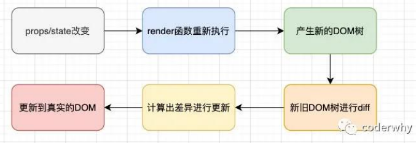

# 04 React组件化开发（二）

## 一、setState的同步和异步

React中我们并不能直接通过修改state的值来让界面发生更新。如果我们直接修改state，React并不知道数据发生了变化，不会重新调用render函数

> 这是因为React并没有实现类似于**Vue2中的Object.defineProperty**或者**Vue3中的Proxy**的方式来监听数据的变化

==因此，必须通过setState来告知React数据已经发生了变化==

### setState的异步更新

```jsx
changeText() {
  // 1.基本使用
  this.setState({
    message: "Hello React!"
  })

  // 2.传入回调函数
  // 好处1: 可以在回调函数内编写新的state逻辑
  // 好处2: 当前回调函数会将之前的state和props作为参数传入
  this.setState((state, props) => {
    return {
      message: "Hello React!"
    }
  })

  // 3. setState的异步调用
  // ★如果希望数据更新后(本质是两个state的数据合并), 立即获取最新的state数据执行一些逻辑代码
  // ★那么可以在setState的第二个参数传入callback
  this.setState({
    message: 'Hello React!'
  })
  console.log('------', this.state.message) // Hello World!
  
  this.setState({
    message: 'Hello React!'
  }, () => {
    console.log('------', this.state.message) // Hello React!
  })
}
```

### ★Q：为什么setState需要设置成异步？

[https://github.com/facebook/react/issues/11527#](https://github.com/facebook/react/issues/11527)[issuecomment-360199710](https://github.com/facebook/react/issues/11527)

- **核心：setState设计为异步，可以显著的提升性能**
  - 如果每次调用setState都进行一次更新，那么意味着render函数会被频繁调用，界面重新渲染，效率很低

- 因此，最好的办法应该是**获取到多个更新，之后进行批量更新**

- 如果同步setState是同步的，但是render函数还没有被执行，那么state和props不能保持同步

### 改setTimeout为同步（React18前）

#### 在延迟为0的setTimeout中更新

```jsx
// React18后无效, setTimeout中的setState是批量更新
changeText() {
  setTimeout(() => {
    this.setState({
      message: 'Hello React!',
    })
    console.log('message:', this.state.message)
  }, 0);
}
```

#### 原生DOM

```jsx
// React18后无效
componentDidMount() {
  const btnEl = document.querySelector('button')
  btnEl.addEventListener('click', () => {
    this.setState({
      message: 'Hello React!',
    })
    console.log('message:', this.state.message)
  })
}
```

> 分成两种情况：
>
> - 在组件生命周期或React合成事件中，setState是异步
>
> - 在setTimeout或者原生dom事件中，setState是同步

==React18后，setState默认是异步的（所有操作都被放到了批处理中）==

如果希望代码可以同步拿到使用，需要执行特殊的`flushSync`操作

```jsx
import { flushSync } from 'react-dom'
changeText() {
  setTimeout(() => {
    flushSync(() => {
      this.setState({
        message: 'Hello React!',
      })
    })
    console.log('message:', this.state.message) // Hello React
  }, 0)
}
```


## 二、★React性能优化SCU

### React的更新流程与diff算法



React在props或state发生改变时，会调用React的render方法，会**创建一颗不同的树**

> React需要基于这两颗不同的树之间的差别来判断如何有效的更新UI：
>
> 如果一棵树参考另外一棵树进行完全比较更新，那么即使是最先进的算法，该算法的复杂程度为 O(n^2)，其中 n 是树中元素的数量。这个开销太过昂贵了，React的更新性能会变得非常低效

React的diff算法优化**【O(n)】**

- 同层节点之间相互比较，不会垮节点比较
- 不同类型的节点，产生不同的树结构
- 开发中，可以通过key来指定哪些节点在不同的渲染下保持稳定

### keys的优化

在遍历列表时，若未指定key属性，将会提示警告

**方式一：在最后位置插入数据** 

- 有无key意义并不大 

**方式二：在前面插入数据**

- 这种做法，在没有key的情况下，所有的li都需要进行修改

> key的注意事项：
>
> - key应该是唯一的
> - key不要使用随机数（随机数在下一次render时，会重新生成一个数字）
> - **使用index作为key，对性能是没有优化的**

### render函数调用与shouldComponentUpdate

经试验发现，App中修改了数据，即使与子组件无关，子组件的render函数也会被调用，这样处理的性能较低。因此，可以通过【`shouldComponentUpdate`，简称 SCU】进行控制

```jsx
shouldComponentUpdate() {
  return false
}
```

但肯定不能这样简单指定是否渲染，而是需要指定**一些判断条件（判断state或者props有没有改变）**

`shouldComponentUpdate`可以接收两个参数：

- 参数一：**nextProps** 修改之后，最新的props属性
- 参数二：**nextState** 修改之后，最新的state属性

```jsx
shouldComponentUpdate(nextProps, newState) {
  if (this.state.message !== newState.message || this.props.message !== nextProps.message) {
    return true
  }
  return false
}
```

### ★PureComponent

如果所有的类都需要手动来实现 `shouldComponentUpdate`，这样会增加非常多的工作量

**==解决方案：将class继承自`PureComponent`==**

```jsx
import React, { PureComponent } from 'react'
export class App extends PureComponent{...}
```

**在开发中，使用类组件时，一般均使用 PureComponent！【rcpe】**

### ★memo

`PureComponent`解决了类组件的情况，但如果是函数组件呢？

==**解决方案：使用高阶函数`memo`**==

将原本的函数组件使用`memo`进行一层包裹即可

```jsx
import { memo } from 'react'

const Profile = memo(function (props) {
  console.log('Profile render')
  return <h2>Profile: {props.message}</h2>
})

export default Profile
```

### ★不可变数据的力量

**只要是在state中的（引用类型）数据，不要去修改！！！**

**如果需要修改，应直接指定一个新的对象！！！**

```jsx
const newBook = { name: '《JavaScript 小书》', price: 60, count: 4 }
// 错误的处理方法：直接修改(PureComponent下无法re-render)
this.state.books.push(newBook)
// 正确的处理方法：浅拷贝
const newBooks = [...this.state.books]
newBooks.push(newBook)
// 或者使用以下简写方式
const newBooks = [...this.state.books, newBook]
// 最后setState触发render
this.setState({
  books: newBooks,
})
```

本质：要使得state中的books对象在内存中指向的地址发生变化

### shallowEqual

`PureComponent`的本质是在`shouldComponentUpdate`中进行了`shallowEqual`的浅层比较：只有在地址发生变化的情况下，`shallowEqual`才会返回true【在函数组件的情况下是一致的】

```jsx
// 伪代码
shouldComponentUpdate(nextProps, nextState) {
  shallowEqual(nextProps, this.props)
  shallowEqual(nextState, this.states)
}
```


## 三、获取DOM/组件方式refs

### DOM

> 在React的开发模式中，通常情况下不需要、也不建议直接操作DOM原生，但是某些特殊的情况，确实需要获取到DOM进行某些操作：
>
> - 管理焦点，文本选择或媒体播放
> - 触发强制动画
> - 第三方库中需要

React 提供了三种方式创建 refs 获取对应的DOM：

**方式1：在React元素上绑定ref字符串（不推荐）**

```html
<h2 ref="why">Hello World</h2>
```

```jsx
console.log(this.refs.why)
```

**方式2：提前创建好ref对象（`React.createRef()`）, 将该对象绑定到元素的current熟悉，使用时获取current即可）（推荐✔）**

```jsx
<h2 ref={this.titleRef}>你好李银河</h2>
```

```jsx
constructor() {
  this.titleRef = React.createRef()
}
getNativeDOM() {
  console.log(this.titleRef.current)
}
```

**方式3：传入回调函数，该函数会传入一个元素对象（el），在DOM被挂载时回调，此时可以进行保存**

```jsx
<h2 ref={el => {this.titleEl = el}}>Hello Geo</h2>
```

```jsx
constructor() {
  this.titleEl = React.createRef()
}
getNativeDOM() {
  console.log(this.titleEl)
}
```

### 类组件（实例）

当 ref 用于类组件时，ref 对象接收组件的挂载实例作为其 current 属性

```jsx
// 类组件
import React, { PureComponent } from 'react'

class Home extends PureComponent {
  test() {
    console.log('test---')
  }

  render() {
    return <h2>Home</h2>
  }
}

export class App extends PureComponent {
  constructor() {
    super()
    this.hmRef = React.createRef()  // 创建ref
  }

  getComponent() {
    console.log(this.hmRef.current)
    this.hmRef.current.test()  // 调用实例方法
  }

  render() {
    return (
      <div>
        <Home ref={this.hmRef}/>
        <button onClick={() => this.getComponent()}>获取组件实例</button>
      </div>
    )
  }
}

export default App
```

### 函数组件（中的DOM）

==但 ref 不能用于函数式组件！！因为它们根本就没有组件实例！！==

然而某些时候，我们可能想要获取**函数式组件中的某个DOM元素**，这时可以使用`React.forwardRef()`

- 相当于实现了类似“转发”的效果

```jsx
import React, { PureComponent, forwardRef } from 'react'

const Home = forwardRef(function (props, ref) {
  return (
    // 绑定ref到h2
    <div>
      <h2 ref={ref}>Hello World</h2>
      <p>12345</p>
    </div>
  )
})

export class App extends PureComponent {
  constructor() {
    super()
    this.hmRef = React.createRef()
  }

  getComponent() {
    console.log(this.hmRef.current)  // 打印<h2>标签(DOM)
  }

  render() {
    return (
      <div>
        <Home ref={this.hmRef} />
        <button onClick={() => this.getComponent()}>获取组件实例</button>
      </div>
    )
  }
}

export default App
```


## 四、★受控与非受控组件


## 五、React高阶组件


## 六、protals和fragment


## 七、StrictMode

