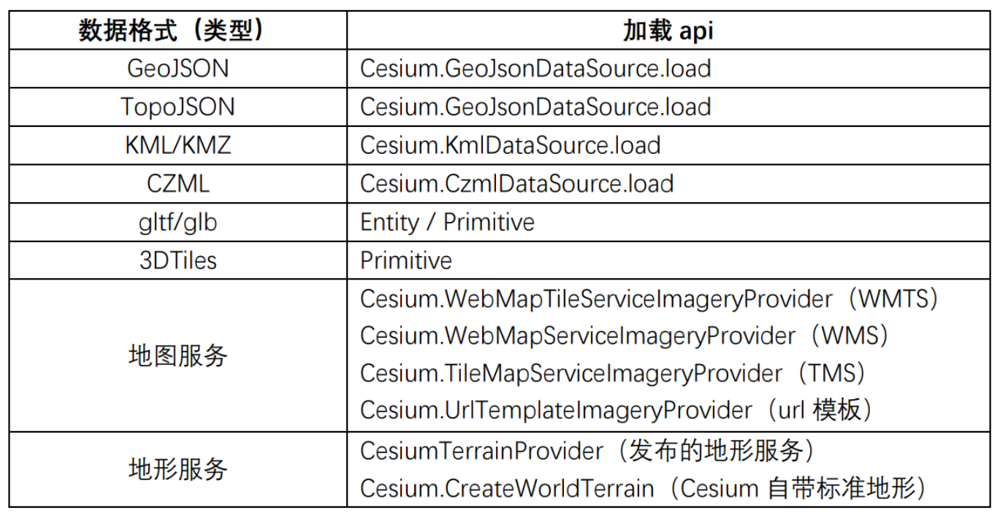
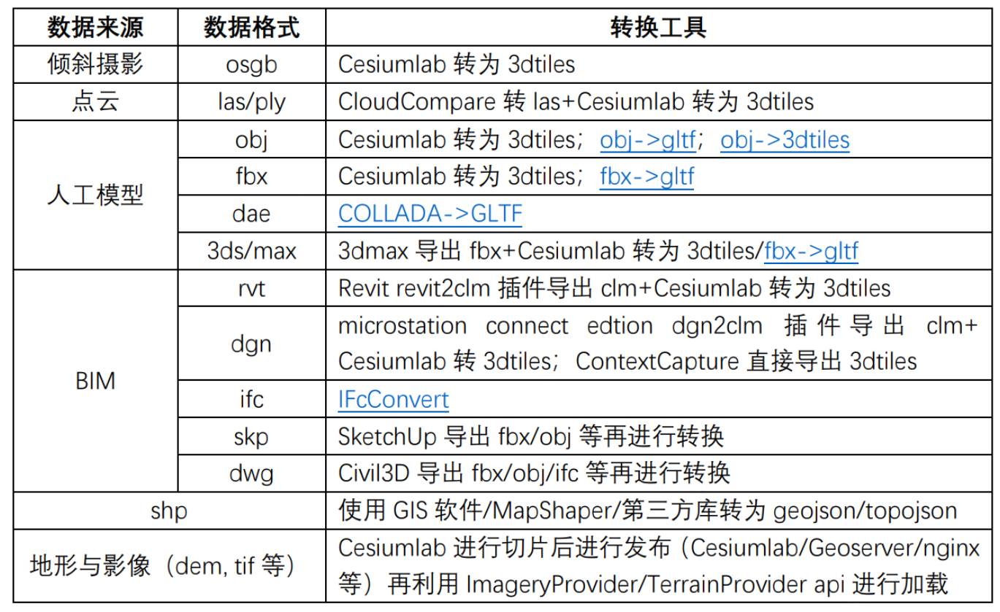

# Cesium导入常用文件格式梳理

## 一、Cesium加载数据汇总

### Cesium能够直接加载的数据类型及加载api



### 需要转换后再加载的数据类型及转换方法




## 二、能够直接加载的数据类型

### 1）矢量数据

#### 1. GeoJSON

- GeoJSON的最外层是一个单独的对象，可表示：① 几何体（Geometry）；② 特征（Feature）；③ 特征集合（FeatureCollection）
- 最外层的 GeoJSON 里可能包含有很多子对象，每一个 GeoJSON 对象都有一个 type ，可以是：Point、MultiPoint、LineString、MultiLineString、Polygon、MultiPolygon、GeometryCollection、Feature、FeatureCollection

**cesium加载方式示例：**

```js
viewer.dataSources.add(Cesium.GeoJsonDataSource.load("/shanghai.geojson", {
    stroke: Cesium.Color.HOTPINK,
    fill: Cesium.Color.PINK.withAlpha(0.5),
    strokeWidth: 3,
}))
```

#### 2. TopoJSON

- TopoJSON是 GeoJSON 按拓扑学编码后的扩展形式，TopoJSON中的每一个几何体都是通过将共享边（arcs）整合后组成的
- TopoJSON使用坐标（点）、弧（线、多边形）来表示地理图形，由transform(变换参数)、objects(地理实体包含空间及属性信息)和arcs(有向弧的空间关系)三部分组成
- 相对于GeoJSON，TopoJSON 消除了冗余，文件大小缩小了 80%

**工具：**

- geojson <=> topojson：http://jeffpaine.github.io/geojson-topojson/

**cesium加载方式示例：**

```js
// 加载topojson
viewer.dataSources.add(Cesium.GeoJsonDataSource.load("/shanghai.topojson", {
    stroke: Cesium.Color.HOTPINK,
    fill: Cesium.Color.PINK.withAlpha(0.5),
    strokeWidth: 3,
  }))
```

#### 3. KML/KMZ

- KML (keyhole markup language)是一种基于XML语法格式的文件，用来描述和存储地理信息数据（点、线、面、多边形、多面体以及模型等），主要应用于 Google Earth相关软件【类似czml与cesium的关系】

**cesium加载方式示例：**

```js
Cesium.KmlDataSource.load("/map.kml", {
    camera: viewer.scene.camera,
    canvas: viewer.scene.canvas,
    screenOverlayContainer: viewer.container,
}).then((dataSource) => {
    viewer.dataSources.add(dataSource)
})
```

#### 4. CZML

- CZML包含点、线、地标、模型和其他的一些图形元素，并指明了这些元素如何随时间而变化

**cesium加载方式示例：**

```js
viewer.dataSources.add(Cesium.CzmlDataSource.load("/Vehicle.czml"))
```


### 2）模型

#### 1. gltf/glb

- ***.gltf：** 基于JSON的文本文件，可使用文本编辑器轻松编辑，通常会引用外部文件，例如纹理贴图、二进制网格数据等； 
- ***.glb：** 是二进制格式，通常文件较小且自包含所有资源，但不容易编辑。
- gltf <-> glb：https://sbtron.github.io/makeglb/

**cesium加载方式示例：**

1. entity

```js
// 指定模型加载的位置
const position = Cesium.Cartesian3.fromDegrees(121.228660, 31.271975, 0)

// 指定视角观察的方向
const heading = Cesium.Math.toRadians(90)
const pitch = Cesium.Math.toRadians(-5)
const roll = 0
const hpr = new Cesium.HeadingPitchRoll(heading, pitch, roll)
const orientation = Cesium.Transforms.headingPitchRollQuaternion(
    position,
    hpr
)

// 加载模型
const entity = viewer.entities.add({
    name: 'gltf',
    position: position,
    orientation: orientation,
    model: {
        uri: '/最新道路+楼.gltf',
        scale: 0.92
    },
})
```

2. primitive

```js
const origin = Cesium.Cartesian3.fromDegrees(121.228660, 31.271975, 0)
const modelMatrix = Cesium.Transforms.eastNorthUpToFixedFrame(origin)
viewer.scene.primitives.add(
    Cesium.Model.fromGltf({
        url: "/最新道路+楼.gltf",
        modelMatrix: modelMatrix,
        minimumPixelSize: 128,
        maximumScale: 20000,
    })
).readyPromise.then((model) => {
    model.activeAnimations.addAll()
})
```

#### 2. 3DTiles

- 在glTF的基础上，加入了分层LOD(Level of Detail)的概念，专门为流式传输和渲染海量 3D 地理空间数据而设计的，例如倾斜摄影、3D 建筑、BIM/CAD、实例化要素集和点云
- 一个瓦片集（Tileset）是由一组瓦片（Tile）按照空间数据结构（树状结构）组织而成的，它至少包含一个用于描述瓦片集的 JSON 文件tileset.json（包含瓦片集的元数据和瓦片对象），其中每一个瓦片对象可以引用以下其中一种格式（b3dm, i3dm, pnts, cmpt）
    - b3dm 和 i3dm 格式是基于 glTF构建的，它们的瓦片内容在二进制体中嵌入了 glTF 资源，包含模型的几何和纹理信息，而 pnts 格式却没有嵌入 glTF 资源
- 调用3DTiles数据的入口文件（tileset.json）

**cesium加载方式示例：primitive**

```js
const tileset = viewer.scene.primitives.add(
    new Cesium.Cesium3DTileset({
        // url: "/tileset.json",
        // url也可指定为cesiumlab等发布的三维模型地址
        url: 'http://localhost:9003/model/t0vT2M90i/tileset.json'
        maximumScreenSpaceError: 1,  // 最大屏幕空间误差
        maximumNumberOfLoadedTiles: 1000  // 最大加载瓦片数
    })
)
```

样式设置（eg. Height属性color）

```js
const properties = tileset.properties
if (Cesium.defined(properties) && Cesium.defined(properties.Height)) {
  tileset.style = new Cesium.Cesium3DTileStyle({
    color: {
      conditions: [
        ...
      ],
    },
  })
}
```

#### gltf <-> 3DTiles

- gltf是一种开放的3D文件格式，3D Tiles则是一种用于高性能可视化大规模地理数据的文件格式

- 工具：https://github.com/CesiumGS/3d-tiles-tools


### 3）地图服务及地形服务

- 地图服务的主要类型：WMTS、WMS、TMS
- 在使用Cesium加载地图服务及地形服务前，首先需将相关GIS数据进行切片【Cesiumlab提供了针对高程数据（dem, tif），影像数据（jpeg, tif）的切片功能，由此生成地形切片.terrain/影像切片.png】，再利用Cesiumlab/Geoserver/nginx等进行发布
- 发布完成后，可利用相关API直接加载
  - 地图服务WMTS：`Cesium.WebMapTileServiceImageryProvider`
  - 地图服务WMS：`Cesium.WebMapServiceImageryProvider`
  - 地图服务TMS：`Cesium.TileMapServiceImageryProvider`
  - url模板：`Cesium.UrlTemplateImageryProvider`
  - 地形服务：`CesiumTerrainProvider`
- Cesium也提供了一些自带的地图及地形服务api，如常用影像ArcGIS（`Cesium.ArcGisMapServerImageryProvider`）与OpenStreetMap（`Cesium.OpenStreetMapImageryProvider`）、标准地形（`Cesium.CreateWorldTerrain`）

**示例：Cesium加载国内常用的地图服务——天地图与高德（WMTS）**

- 天地图

```js
const webKey = '7b13a4031f051b6317cdcca67ae391f1'
viewer.imageryLayers.addImageryProvider(
  new Cesium.WebMapTileServiceImageryProvider({
    // 影像
    url: 'http://t0.tianditu.com/cia_w/wmts?service=wmts&request=GetTile&version=1.0.0&LAYER=cia&tileMatrixSet=w&TileMatrix={TileMatrix}&TileRow={TileRow}&TileCol={TileCol}&style=default.jpg&tk=' + webKey,
    // 矢量
    // url: 'http://t0.tianditu.com/vec_w/wmts?service=wmts&request=GetTile&version=1.0.0&LAYER=vec&tileMatrixSet=w&TileMatrix={TileMatrix}&TileRow={TileRow}&TileCol={TileCol}&style=default&format=tiles&tk=' + webKey,
    layer: 'tdtAnnoLayer',
    style: 'default',
    format: 'image/jpeg',
    tileMatrixSetID: 'GoogleMapsCompatible',
    show: false,
  })
)
```

- 高德：更换以上代码中的url即可
    - 无注记影像：https://webst02.is.autonavi.com/appmaptile?style=6&x={x}&y={y}&z={z}
    - 有注记影像：http://webst02.is.autonavi.com/appmaptile?x={x}&y={y}&z={z}&lang=zh_cn&size=1&scale=1&style=8
    - 矢量：http://webrd02.is.autonavi.com/appmaptile?lang=zh_cn&size=1&scale=1&style=8&x={x}&y={y}&z={z}

**示例：Cesium加载ArcGIS与OpenStreetMap**

- ArcGIS

```js
const arcgisProvider = new Cesium.ArcGisMapServerImageryProvider({
  url: "https://map.geoq.cn/arcgis/rest/services/ChinaOnlineStreetPurplishBlue/MapServer",
})
viewer.imageryLayers.addImageryProvider(arcgisProvider)
```

- OpenStreetMap

```js
const osm = new Cesium.OpenStreetMapImageryProvider({
  url: "https://a.tile.openstreetmap.org/",
  minimumLevel: 0,
  maximumLevel: 18,
  fileExtension: "png",
})
viewer.imageryLayers.addImageryProvider(osm)
```

**示例：Cesium加载Geoserver发布的WMS服务**

```js
viewer.imageryLayers.addImageryProvider(new Cesium.WebMapServiceImageryProvider({
  url:'http://localhost:8080/geoserver/workspace0913/wms', 
  // 图层预览里面的名称
  layers:'workspace0913:xpdy_wgs84',            
  parameters: {
    service: "WMS",
    format: "image/png",
    transparent: true,
  },
}))
```

**示例：Cesium加载自带标准地形**

```js
viewer.terrainProvider = Cesium.CreateWorldTerrain()
```

**示例：Cesium加载Cesiumlab发布的地形服务**

```js
const viewer = new Cesium.Viewer("cesiumContainer", {
  terrainProvider: Cesium.CesiumTerrainProvider({
      url: 'http://localhost:9003/terrain/a1P7r4qS/',
      requestWaterMask: true,
      credit: 'http://www.bjxbsj.cn/'
  })
})
```


## 三、需要转换的数据类型

### 1）osgb

osgb（Open Scene Gragh Binary）常用于倾斜摄影中

转换工具：Cesiumlab -> 3DTiles（b3dm）

参考：https://jackie-sun.blog.csdn.net/article/details/124184886?spm=1001.2101.3001.6650.2&utm_medium=distribute.pc_relevant.none-task-blog-2%7Edefault%7EBlogCommendFromBaidu%7ERate-2-124184886-blog-126804400.235%5Ev43%5Econtrol&depth_1-utm_source=distribute.pc_relevant.none-task-blog-2%7Edefault%7EBlogCommendFromBaidu%7ERate-2-124184886-blog-126804400.235%5Ev43%5Econtrol&utm_relevant_index=3

### 2）点云

常用点云格式：las, ply...

转换步骤：

- 使用Cloud Compare/其他点云处理软件 将点云转换为las标准格式
- 使用Cesiumlab转为3DTiles（其中的pnts格式）

参考：https://blog.csdn.net/weixin_44539625/article/details/108309700

### 3）人工模型

主要使用相关工具转换为gltf/3dtiles后在cesium中加载

各种模型种类及转换方式：

#### 1. obj

- Cesiumlab

- obj->gltf：https://github.com/CesiumGS/obj2gltf

- obj->3dtiles：https://github.com/PrincessGod/objTo3d-tiles
    - 将数据转为瓦片（b3dm/i3dm）；再将多个瓦片捆绑为一个瓦片集（tileset）

#### 2. fbx

- Cesiumlab
- fbx->gltf：https://github.com/facebookincubator/FBX2glTF
  - `FBX2glTF ~/models/butterfly.fbx`

#### 3. dae

- COLLADA->GLTF：https://github.com/KhronosGroup/COLLADA2GLTF
  - `collada2gltf.exe–f daePath -e 或者 collada2gltf.exe–f daePath -o gltfPath`

#### 4. 3ds/max

- 步骤1：使用3dmax加载数据及纹理图片
- 步骤2：使用3dmax导出为fbx
- 步骤3：fbx->gltf：https://github.com/facebookincubator/FBX2glTF
  - `FBX2glTF ~/models/butterfly.fbx`

### 4）BIM

#### 1. rvt（Rivit）

- Cesiumlab中下载Revit revit2clm插件，将模型导入Revit中导出为clm（CesiumLab Model，Cesiumlab自定义的BIM数据中间格式），再由clm转为3dtiles
- Revit可导出fbx, ifc等格式，再转gltf/3dtiles；也可使用FBX Converter（https://aps.autodesk.com/developer/overview/fbx-sdk）

#### 2. dgn（Bentley）

- 安装microstation connect edtion，在Cesiumlab中下载使用dgn2clm插件导出为clm【具体见Cesiumlab文档】，再由clm转为3dtiles
- 由Bentley提供的三维现实模型软件ContextCapture支持直接导出3dtiles

#### 3. ifc（Industry Foundation Classes）

- IFcConvert支持使用命令行将ifc格式转为glb/3dtiles格式：https://github.com/IfcOpenShell/IfcOpenShell?tab=readme-ov-file，https://blenderbim.org/docs-python/ifcconvert.html

#### 4. skp（Sketchup）

- SketchUp的专有格式，可通过导出fbx, obj等通用格式再转为gltf/3dtiles

#### 5. dwg（Civil3D）

- Civil3D可导出fbx, ifc等格式，再转gltf/3dtiles

### 5）shapefile

由于shapefile结构复杂，Cesium无法直接加载

解决办法：转为geojson/topojson
- GIS软件（ArcGIS、QGIS）
- MapShaper：http://mapshaper.org/
- 第三方库（https://github.com/MikesWei/CesiumVectorTile）
