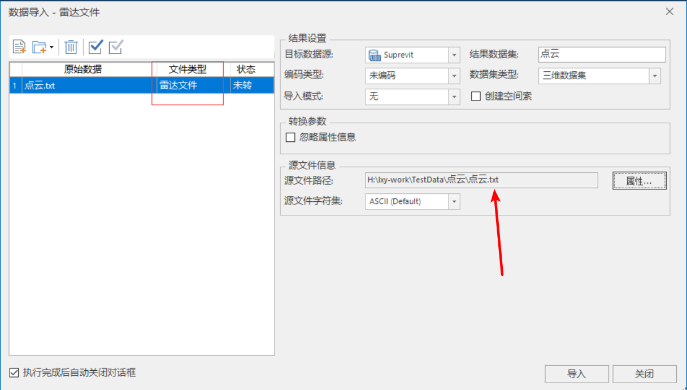
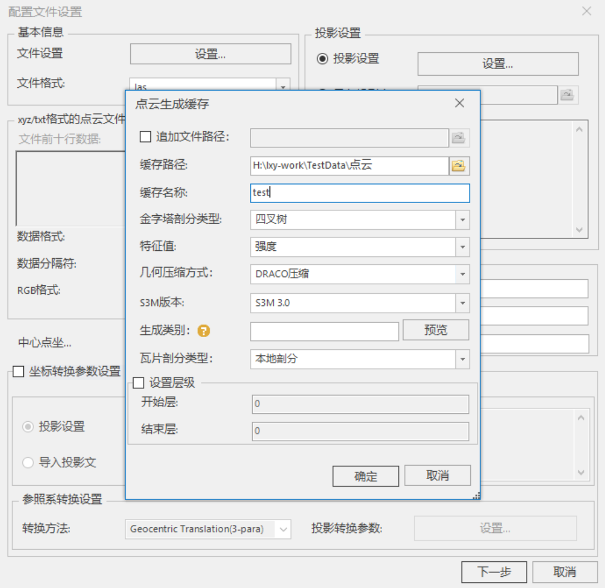
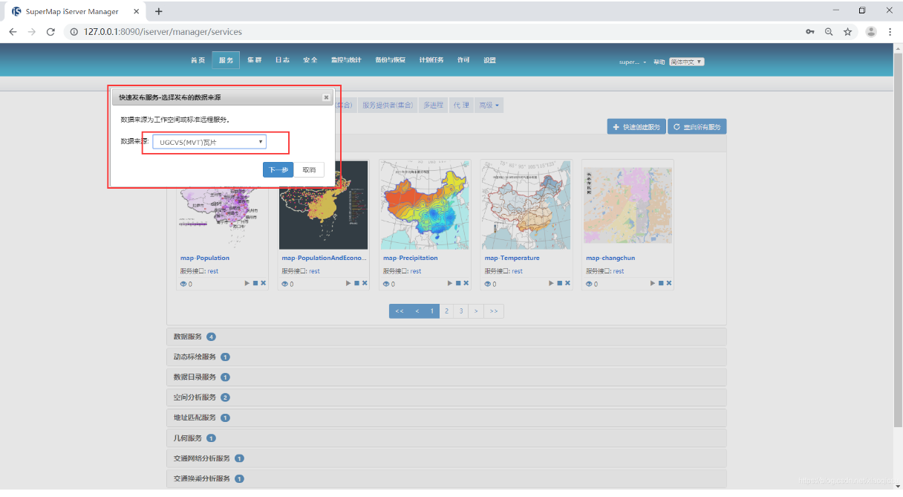

# SuperMap梳理

## 一、底图

提供了国内常用的天地图API：`Cesium.TiandituImageryProvider`

```js
function onload(Cesium) {
  var viewer = new Cesium.Viewer('cesiumContainer')
  var labelImagery = new Cesium.TiandituImageryProvider({
    mapStyle: Cesium.TiandituMapsStyle.CIA_C, // 以天地图全球中文注记为例
    token: TOKEN_TIANDITU, // 由天地图官网申请的密钥
  })
  viewer.imageryLayers.addImageryProvider(labelImagery)
}
```

其他底图（如ArcGIS、OSM）可采用原生Cesium进行加载


## 二、地形

**加载**

```js
terrainProvider: new Cesium.CesiumTerrainProvider({
  url: TEST_TERRAIN, // 地形服务的地址
  isSct: true, // 地形服务源自SuperMap iServer发布时需设置isSct为true
})
```

**处理**

SuperMap支持对栅格数据集生成三维地形缓存，即把地形数据处理为切片（Tile）文件，从而在SuperMap iClient3D for Cesium访问由SuperMap iServer发布三维服务，实现地形数据加载

核心步骤：1）生成缓存数据；2）发布三维服务；3）客户端加载地形数据

supermap提供了完整详细的操作文档：http://support.supermap.com.cn/DataWarehouse/WebDocHelp/iPortal/webgl/examples/TopicDOC/LoadTerrain_OperateTopic.html


## 三、影像

**加载**

```js
var layer = new Cesium.SuperMapImageryProvider({
  url: TEST_IMG, // 影像服务的地址
})
var imgLayer = viewer.imageryLayers.addImageryProvider(layer)
```

**处理**

操作与【地形图层处理】基本一致，操作文档：http://support.supermap.com.cn/DataWarehouse/WebDocHelp/iPortal/webgl/examples/TopicDOC/LoadImagery_OperateTopic.html


## 四、三维图层

超图中加载三维图层采用的数据格式为s3m：s3m是一种开放式可扩展的三维地理空间数据格式——Spatial3DModel（S3M），对倾斜摄影模型、人工建模数据、BIM、点云、三维管线、二维/三维点线面等各类数据进行整合，适用于海量、多源异构三维地理空间数据和Web环境下的传输与解析

**加载s3m**

（1）通过open接口将整个场景打开，这种方法简单易操作且不易出现遗漏图层的情况

```js
var scene = viewer.scene
var promise = scene.open("http://localhost:8090/iserver/services/3D-test/rest/realspace")  // url为在SuperMap iServer上发布的服务地址
```

（2）通过`addS3MTilesLayerByScp`接口进行添加，该方式的优势是，可以根据自己的需要选择部分图层添加到场景中，提高加载性能，但需要加载多图层的整个场景时，不如`scene.open`方便。

```js
var promise = scene.addS3MTilesLayerByScp(
  'http://localhost:8090/iserver/services/3D-test/rest/realspace/datas/zj/config',
  {
    name: 'base', // 图层名称
    cacheKey: '123456', // 三维缓存密钥，由SuperMap iServer设置和获取
  }
)
promise.then(function (layer) {
  layer.visible = true
})

```

**处理**

1. **倾斜摄影（osgb）**

   核心步骤：1）生成配置文件 scp；2）倾斜入库；3）发布三维服务；4）客户端浏览倾斜摄影模型

   supermap提供了完整详细的操作文档：http://support.supermap.com.cn/DataWarehouse/WebDocHelp/iPortal/webgl/examples/TopicDOC/LoadObliqueModel_OperateTopic.html

2. **BIM与精细模型**

   SuperMap iClient3D for Cesium客户端加载BIM、精细模型与加载倾斜摄影模型的方法类似，大致操作流程有以下：1）生成三维切片缓存（包含一个scp，一个json文件及众多的s3mb Tile的文件夹）；2）发布三维服务；3）客户端浏览倾斜摄影模型

   在【生成三维切片缓存】前需要将数据导入到supermap中，需要下载插件（http://support.supermap.com.cn/DownloadCenter/DownloadPage.aspx?tt=ProductAAS&id=134）【支持BIM，3ds Max，AutoDesk CAD，Civil3D，GIM，IFC等格式的数据】

   supermap提供了完整详细的操作文档：

   - http://support.supermap.com.cn/DataWarehouse/WebDocHelp/iPortal/webgl/examples/TopicDOC/LoadBIM_OperateTopic.html#01CreatS3M
   - 生成三维切片缓存：http://support.supermap.com.cn/DataWarehouse/WebDocHelp/iDesktop/SuperMap_iDesktop_10i.htm

3. **点云**

   SuperMap iDesktop支持以下两种方式加载点云数据：

   - 【导入点云作为数据集】此方法仅支持**txt**形式的点云

     

   - 【点云缓存】除了txt格式的点云数据都需要采用此种方式（如las, ply, pcd...）

     

     该工具会在指定缓存路径下产生一个以缓存名称命名的文件夹，文件夹中包含一个**scp索引文件**，以及多个存有**s3mb模型**文件的文件夹

     在生成scp后，后续的发布与倾斜摄影、BIM相同（http://support.supermap.com.cn/DataWarehouse/WebDocHelp/iPortal/webgl/examples/TopicDOC/LoadObliqueModel_OperateTopic.html）

4. **3dtiles**

   - SuperMap iDesktopX直接提供了3dtiles->s3m的转换工具（https://help.supermap.com/iDesktopX/1101/zh/tutorial/SceneOperation/OSGB/OSGBFilesManagement/3DTilesToS3M）。转换完成后，再进行三维服务发布，并利用加载s3m的API进行显示

   - 同时，SuperMap iServer也直接支持用tileset.json发布（在发布时类型选择3DTiles缓存）。发布后使用`Cesium.Cesium3DTileset`进行加载即可（http://support.supermap.com.cn:8090/webgl/Cesium/docs/Documentation/Cesium3DTileset.html?classFilter=Cesium3DTileset）【其实就是原生Cesium语法】

     ```js
     var tileset = scene.primitives.add(new Cesium.Cesium3DTileset({
        url : 'http://localhost:8002/tilesets/Seattle'
     }))
     ```

5. **gltf**

   SuperMap iClient3D for Cesium可通过KML文件直接加载gltf格式的三维模型（http://support.supermap.com.cn/DataWarehouse/WebDocHelp/iPortal/webgl/examples/TopicDOC/LoadGltfModel_OperateTopic.html）

   ```js
   var viewer = new Cesium.Viewer('cesiumContainer')
   viewer.dataSources.add(Cesium.KmlDataSource.load('../../SampleData/facilities.kmz'), {
     camera: viewer.scene.camera,
     canvas: viewer.scene.canvas,
   })
   ```

   

## 五、矢量

**mvt切片**

- SuperMap iDesktop桌面产品支持将矢量数据生成遵循MapBox MVT规范的矢量瓦片（mvt）

- 切片完成后，将产生如下文件夹和文件：

  - fonts：矢量瓦片使用的字体文件（如果切的地图中没有文本则不会生成）

  - sprites：矢量瓦片图标相关风格内容资源

  - styles：矢量瓦片风格描述文件

  - **tiles：矢量瓦片数据（.mvt文件）**。在tiles文件夹下，瓦片按照比例尺层级进行分文件夹存储，文件夹名称为全球剖分层级，级数从0开始计数。层级文件夹下的子文件夹命名为全球剖分的列号，其下为矢量瓦片文件，格式为.mvt，文件名称为全球剖分的行号

  - **sci文件**：矢量瓦片的元信息描述文件，记录了数据的投影、地理范围、层级比例尺等信息

- 使用SuperMap iServer进行发布矢量瓦片服务，数据来源选择mvt

  

- 利用`scene.addVectorTilesMap`加载

```js
var mvtMap = scene.addVectorTilesMap({
  url: url, // MVT的服务地址
  canvasWidth: 512,
  name: 'testMVT',
  viewer: viewer,
})
```

**其他矢量数据**

SuperMap iClient3D for Cesium由于是对Cesium的二次封装，在加载kml/kmz、geojson/topojson、czml的API与原生Cesium相同

- kml/kmz：`Cesium.GeoJsonDataSource`
- geojson/topojson：`Cesium.GeoJsonDataSource`
- czml：` Cesium.CzmlDataSource`


## 六、地图服务

对于WMS、WMTS、TMS等服务，加载方式与Cesium原生API相一致

- WMTS：`Cesium.WebMapTileServiceImageryProvider`
- WMS：`Cesium.WebMapServiceImageryProvider`
- TMS：`Cesium.TileMapServiceImageryProvider`
- url模板：`Cesium.UrlTemplateImageryProvider`

如果地图服务的类型不是OGC服务，使用Cesium原生的url模板方式进行加载可能存在问题，可以使用 `Cesium.SuperMapImageryProvider`

```js
// 创建provider
var provider = new Cesium.SuperMapImageryProvider({ url: URL_CONFIG.ZF_IMG })
// 创建影像图层
var layer = viewer.imageryLayers.addImageryProvider(provider)
```


## 总结

超图的三维最主要是提出了一种新的数据标准s3m，这也是国内最新发布的数据规范标准【完全对标美国esri的I3S(slpk)】s3m与其他超图系列产品（SuperMap iDesktop和SuperMap iServer）进行关联【类似于slpk和ArcGIS的强绑定】，提供了各类三维数据转为s3m的相关方法。

除了在开源的原生Cesium上开发的SuperMap iClient3D for Cesium外，超图还开发了SuperMap iClient3D for WebGL。两者有部分关联性，但代码上也有许多不同的地方。【其实这个就是和esri和ArcGIS的整套产品体系更像了】

总的来说，超图似乎还是基于Cesium的这一套用的更多一些。特别是在国内的开发来说，超图的国产化以及较为友好的中文文档及社区支持也是更为便捷的。