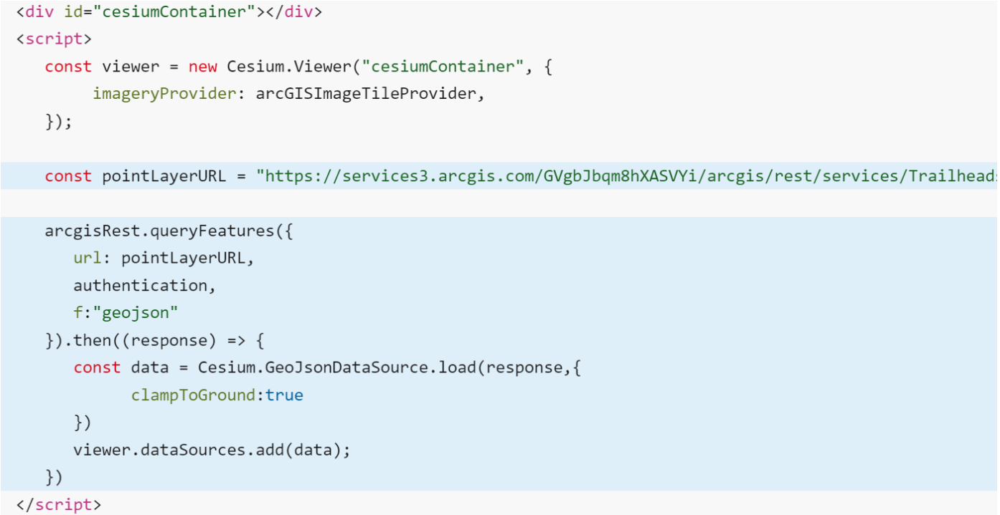
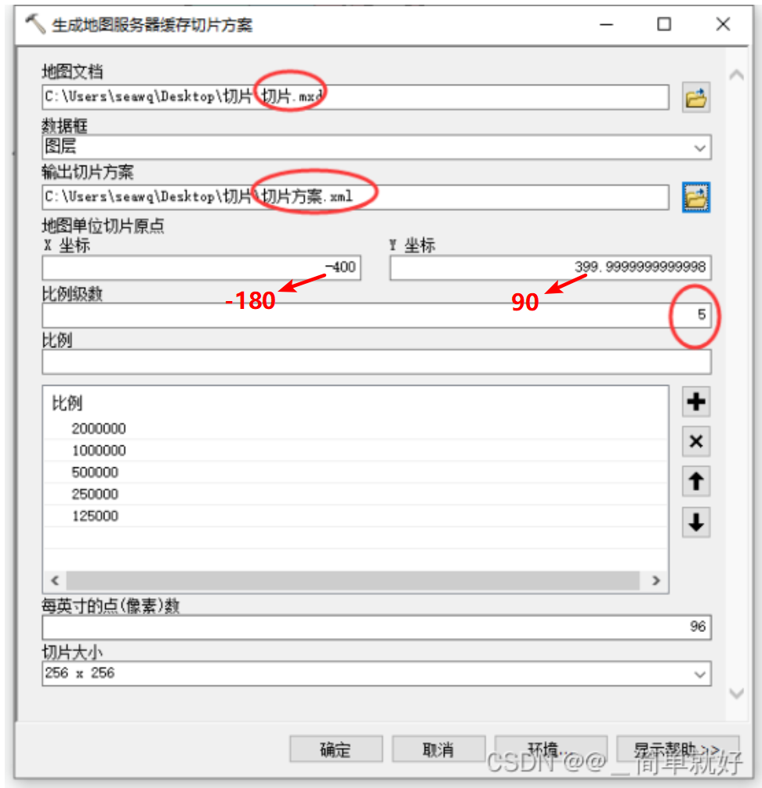
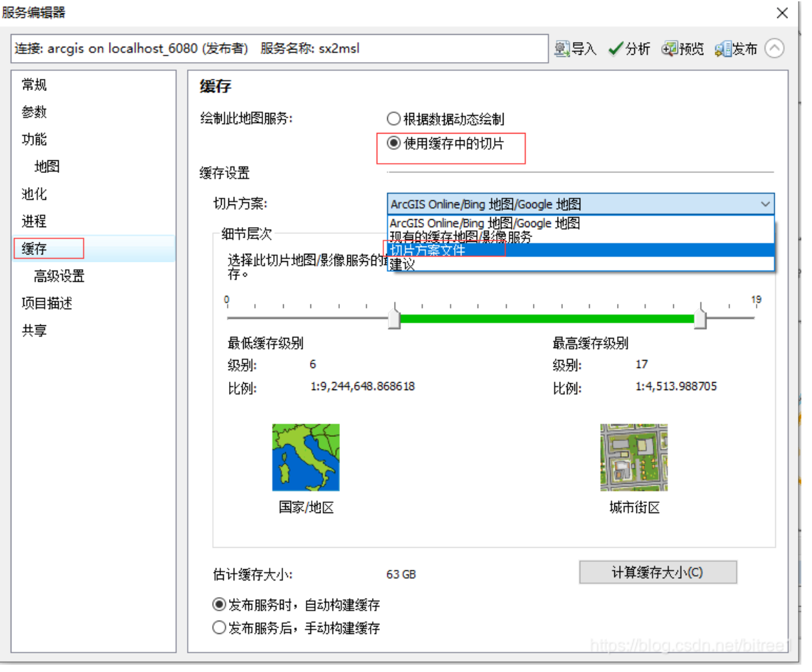

## Q1：osgb->3dtiles的其他方式

https://github.com/fanvanzh/3dtiles 提供了osgb/shp -> 3dtiles及osgb/obj -> glb的转换方案

```sh
# from osgb dataset
3dtile.exe -f osgb -i E:\osgb_path -o E:\out_path
3dtile.exe -f osgb -i E:\osgb_path -o E:\out_path -c "{\"offset\": 0}"
# from single shp file
3dtile.exe -f shape -i E:\Data\aa.shp -o E:\Data\aa --height height
# from single osgb file to glb file
3dtile.exe -f gltf -i E:\Data\TT\001.osgb -o E:\Data\TT\001.glb
# from single obj file to glb file
3dtile.exe -f gltf -i E:\Data\TT\001.obj -o E:\Data\TT\001.glb
```


## Q2：cesium + arcgis

Cesium可以访问ArcGIS中托管的数据服务，支持的数据类型包括 **Feature（FeatureServer）**、**I3S（SceneServer）**、**Map Tiles（MapServer）**

### **1）Feature（FeatureServer）**

使用 ArcGIS REST JS 查询要素并以 GeoJSON 形式返回结果，使用 Cesium添加要素数据，使用**Cesium.GeoJsonDataSource.load**加载

参考：https://developers.arcgis.com/cesiumjs/layers/add-features-as-geojson/



### **2）I3S（SceneServer）**

**【注：I3S规范（OGC Indexed 3D Scene Layer），slpk 是基于该规范的三维数据格式规范】**

Cesium支持加载ArcGIS发布的场景服务中的以下I3S层：3D对象（如建筑物实体）、集成网格（如倾斜摄影）

Cesium加载API：**I3SDataProvider.fromUrl + primitive**

```js
const i3sData = await I3SDataProvider.fromUrl("https://tiles.arcgis.com/tiles/z2tnIkrLQ2BRzr6P/arcgis/rest/services/Frankfurt2017_vi3s_18/SceneServer/layers/0")
viewer.scene.primitives.add(i3sData)
```

### **3）Map Tiles（MapServer）**

Cesium加载API：**ArcGisMapServerImageryProvider.fromUrl**

```js
const santaMonicaParcels = Cesium.ArcGisMapServerImageryProvider.fromUrl("https://tiles.arcgis.com/tiles/P3ePLMYs2RVChkJx/arcgis/rest/services/WV03_Kilauea_20180519_ShortwaveInfrared/MapServer", {token:apiKey})
viewer.scene.imageryLayers.add(Cesium.ImageryLayer.fromProviderAsync(santaMonicaParcels))
```

注：以上的Map Tiles为自己发布的地图切片服务（应该是只包含研究区域的），也可以直接调用ArcGIS的底图服务，API也是**ArcGisMapServerImageryProvider**【之前已经提到过】

```js
const arcgisProvider = new Cesium.ArcGisMapServerImageryProvider({url: "https://map.geoq.cn/arcgis/rest/services/ChinaOnlineStreetPurplishBlue/MapServer",})
viewer.imageryLayers.addImageryProvider(arcgisProvider)
```


## Q3：ArcGIS JS API与3dtiles

ArcGIS Pro起初不支持对3dtiles的加载，在ArcGIS Pro 3.2（2023.11）起新增了对3dtiles数据的**加载**，但暂不支持对3dtiles转为**slpk**

可通过第三方库的方式将3dtiles转为**slpk**：`loaders.gl`（https://loaders.gl/docs/modules/tile-converter/api-reference/3d-tiles-converter））

```js
import {Tiles3DConverter} from '@loaders.gl/tile-converter'
const TILESET_URL = 'https://tiles.arcgis.com/tiles/u0sSNqDXr7puKJrF/arcgis/rest/services/Frankfurt2017_v17/SceneServer/layers/0'  // 指向3dtiles的tileset.json
const converter = new Tiles3DConverter()
await converter.convert({
  inputUrl: TILESET_URL,
  outputPath: 'data',
  tilesetName: 'Frankfurt',
  maxDepth: 2
})
```

转为**slpk**后，可再用ArcGIS Pro进行加载与发布


## Q4：Cesium与坐标系4490服务

- 前文提到了Cesium中加载ArcGIS发布的服务的API为`Cesium.ArcGisMapServerImageryProvider`。然而，Cesium默认只支持wgs84地理坐标系（4326）的服务，对于CGCS2000坐标系（4490）的服务则无法通过`Cesium.ArcGisMapServerImageryProvider`直接加载

**解决方案：修改Cesium源码**

主要步骤：修改`ArcGisMapServerImageryProvider`类；修改`GeographicTilingScheme`类；定义CGCS2000椭球参数

参考：

1. https://blog.csdn.net/wokao253615105/article/details/123462643?spm=1001.2101.3001.6661.1&utm_medium=distribute.pc_relevant_t0.none-task-blog-2%7Edefault%7EBlogCommendFromBaidu%7ERate-1-123462643-blog-112003278.235%5Ev43%5Epc_blog_bottom_relevance_base5&depth_1-utm_source=distribute.pc_relevant_t0.none-task-blog-2%7Edefault%7EBlogCommendFromBaidu%7ERate-1-123462643-blog-112003278.235%5Ev43%5Epc_blog_bottom_relevance_base5&utm_relevant_index=1
2. https://blog.csdn.net/feifei2211/article/details/93872868?utm_medium=distribute.pc_relevant.none-task-blog-2~default~baidujs_baidulandingword~default-1-93872868-blog-112003278.235\^v43\^pc_blog_bottom_relevance_base5&spm=1001.2101.3001.4242.1&utm_relevant_index=4

利：可以加载一切使用ArcGIS发布的4490服务

弊：修改源码步骤复杂

- 但是，可以直接使用`Cesium.WebMapServiceImageryProvider`加载符合OGC标准的WMTS服务，但也只能针对于原点在X: -180.0；Y: 90.0的情况，对于原点在X: -400.0；Y: 400.0时还是无法正常加载

使用`Cesium.WebMapServiceImageryProvider`加载WMTS：

```js
const provider = new Cesium.WebMapTileServiceImageryProvider({
  url: 'http://61.175.211.102/arcgis/rest/services/TDT/SLDT/MapServer/WMTS/tile/1.0.0/TDT_SLDT/{Style}/{TileMatrixSet}/{TileMatrix}/{TileRow}/{TileCol}.png',
  layer: 'wzmap_map',
  style: 'default',
  tileMatrixSetID: 'default028mm',
  format: 'image/png',
  tilingScheme: new Cesium.GeographicTilingScheme(),
  maximumLevel: 21,
  tileMatrixLabels: ['1', '2', '3', '4', '5', '6', '7', '8', '9', '10', '11', '12', '13', '14', '15', '16', '17', '18', '19', '20', '21']
})
const imageryLayers = viewer.imageryLayers
imageryLayers.addImageryProvider(provider)
```

参考：

1. https://blog.csdn.net/chenguizhenaza/article/details/112003278
2. https://blog.csdn.net/A873054267/article/details/86652620

**注：切片原点可以在生成切片方案时进行定义**

具体方法：

1. 在使用ArcGIS/ArcGIS Pro【生成地图服务器缓存切片方案】或【生成切片缓存方案】工具生成【切片方案xml文件】，其中可以修改原点、比例级数及具体比例尺大小



2. 使用【管理切片缓存】进行切片；或直接利用ArcGIS进行发布（注意在发布时选择【使用缓存中的切片】）



参考：

1. https://jackie-sun.blog.csdn.net/article/details/123505973?spm=1001.2101.3001.6661.1&utm_medium=distribute.pc_relevant_t0.none-task-blog-2%7Edefault%7EBlogCommendFromBaidu%7ERate-1-123505973-blog-89384697.235%5Ev43%5Epc_blog_bottom_relevance_base5&depth_1-utm_source=distribute.pc_relevant_t0.none-task-blog-2%7Edefault%7EBlogCommendFromBaidu%7ERate-1-123505973-blog-89384697.235%5Ev43%5Epc_blog_bottom_relevance_base5&utm_relevant_index=1
2. https://blog.csdn.net/bitree1/article/details/89384697?spm=1001.2101.3001.6661.1&utm_medium=distribute.pc_relevant_t0.none-task-blog-2%7Edefault%7EBlogCommendFromBaidu%7ERate-1-89384697-blog-77574863.235%5Ev43%5Epc_blog_bottom_relevance_base5&depth_1-utm_source=distribute.pc_relevant_t0.none-task-blog-2%7Edefault%7EBlogCommendFromBaidu%7ERate-1-89384697-blog-77574863.235%5Ev43%5Epc_blog_bottom_relevance_base5&utm_relevant_index=1